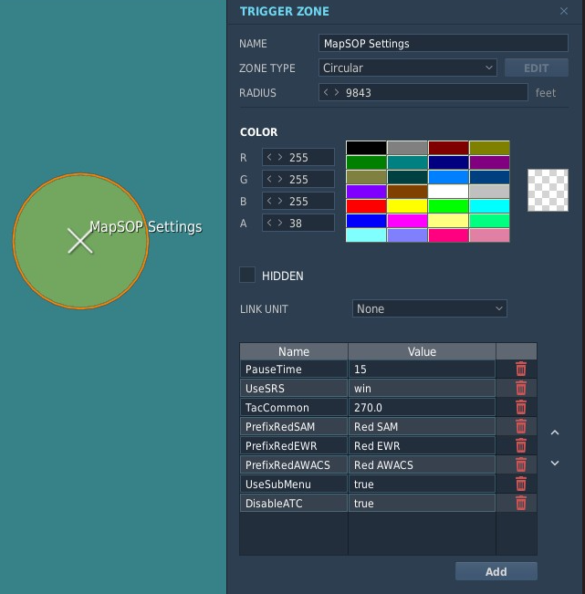

# 51st VFW MapSOP Script

## Summary
`51st VFW MapSOP` is a MOOSE-based Lua script to save 51st VFW mission creators time and effort in the creation of [51st VFW SOP](https://github.com/51st-Vfw/MissionEditing-Index/blob/master/documentation/me_sops.md)-compliant missions.

It is highly recommend to use MapSOP in conjunction with the [51st VFW Mission Editing Templates](https://github.com/51st-Vfw/MissionEditing-Templates), which have MapSOP pre-included along with template examples of the various MapSOP features that are easy to modify for your mission.

***General Note:*** All Zone/Unit/Property names used by MapSOP are case-sensitive.

---
## Index
- [Summary](#summary)
### General Configuration
- [Activating MapSOP](#activating-mapsop)
  - [Loading Skynet](#loading-skynet)
- [MapSOP Settings](#mapsop-settings)
- [Mission Auto-Pause](#mapsop-auto-pause)
- [AI ATC Enable/Disable](#ai-atc-enabledisable)
### Land-based Tanker and AWACS
- [Create MapSOP Tanker and AWACS Flights](#create-mapsop-tanker-and-awacs-flights)
- [Changing MapSOP Tanker and AWACS Flight Settings](#changing-mapsop-tanker-and-awacs-flight-settings)
- [Adding Additional Orbit Tracks/Settings](#adding-additional-orbit-trackssettings-for-tankers-and-awacs-flights)
- [Create RedFor Tanker and AWACS Flights](#create-redfor-tanker-and-awacs-flights)
- [Designate Home Airbase for MapSOP Tanker/AWACS](#designate-home-airbase-for-mapsop-tankerawacs)
- [SRS Text-to-Speech Radio Calls](#tankerawacs-srs-text-to-speech-pushing-track-and-on-station-radio-calls)
### Carrier and Navy-Based Groups
- [Enable MapSOP Aircraft Carrier Enhancements](#enable-mapsop-aircraft-carrier-enhancements)
### IADS
- [Configuring IADS](#configuring-iads)
  - [Skynet](#skynet) 
  - [MANTIS](#mantis-moose-iads)
### Text-to-Speech
- [Text-to-Speech Prerequisites](Text-to-Speech)


---

## Activating MapSOP
In the DCS Mission Editor Triggers menu, load the MOOSE `Moose_.lua` and the MapSOP `51stMapSOP.lua` scripts with '*DO SCRIPT FILE*' on '*MISSION START*': 


### Loading Skynet
If you wish to use **[Skynet](#skynet)** instead of MOOSE's **[Mantis](#mantis-moose-iads)** for IADS, load the MIST and *Skynet* scripts from the [Skynet Github Repo](https://github.com/walder/Skynet-IADS) under `/demo-missions` before `51stMapSOP.lua` as shown: 


---

## MapSOP Settings
The following general MapSOP settings are available: 
| **Setting**      | **Default / 'SOP' Value**   | **Description**   
| ---------------- | --------------------------- | ---------------
| `PauseTime`      | 30                          | Seconds after mission start when MapSOP will pause the mission if no client has slotted, `0` to disable pause. See: [Mission Auto-Pause](#mapsop-auto-pause)
| `UseSRS`         | win                         | SRS Text-to-Speech provider. Set `win` for Windows TTS, `gcloud` for Google Cloud TTS, or `false` to disable. See: [Text-to-Speech](#text-to-speech)
| `TacCommon`      | 270.0                       | Frequency (typically 'Tac Common') on which Tanker/AWACS and Carriers will transmit SRS Text-to-Speech calls. See: [Text-to-Speech](#text-to-speech)
| `PrefixRedSAM`   | Red SAM                     | Group name prefix for Red SAM groups that should be added to the IADS network. See: [IADS](#IADS)
| `PrefixRedEWR`   | Red EWR                     | Group name prefix for Red EWR groups that should be added to the IADS network. See: [IADS](#IADS)
| `PrefixRedAWACS` | Red AWACS                   | Group name prefix for Red AWACS groups that should be added to the IADS network. See: [IADS](#IADS)
| `DisableATC`     | true                        | If `true`, AI ATC at all airbases is disabled by default. Can be overridden per-Airbase using Trigger Zones. See: [AI ATC Enable/Disable](#ai-atc-enabledisable)
| `UseSubMenu`     | false                       | If `true`, all MapSOP F10/Other radio menus will be placed under a sub-menu called `MapSOP Controls` instead of at the top level.

These can be set in two ways:
  1. Create a Trigger Zone in the DCS Mission Editor called 'MapSOP Settings' containing properties with the above settings:

      
  2. Prior to loading `51stMapSOP.lua` (see: [Activating MapSOP](#activating-mapsop)), define a Lua global variable table called `MAPSOP_Settings` with the above MapSOP settings as key/value pairs, for example:
      ```lua
      MAPSOP_Settings = {
        PauseTime = 30,
        UseSRS = gcloud,
        TacCommon = 270.0,
        PrefixRedSAM = "Red SAM",
        PrefixRedEWR = "PrefixRedEWR",
        PrefixRedAWACS = "Red AWACS",
        UseSubMenu = false
      }
      ```

---

## MapSOP Auto-Pause
By default, MapSOP will pause the server after 30 second of mission time if a client has not slotted into an aircraft (or after a period when no clients are connected), and unpause it when any client slots into an aircraft. 

To change the mission time at which the mission pauses, create a Trigger Zone called `MapSOP Settings` with a property called `PauseTime` with the number of mission seconds at which the mission should pause, as described [above](#mapsop-settings). A `PauseTime` value of `0` disables the pause.

The pause/unpause functionality is disabled when running locally in single-player mode.

Alternatively, Trigger Zone(s) starting with `Unpause Client` can be created. An 'Unpause Client' zone created over 'Client' aircraft unit(s) will cause the mission to only automatically unpause when an aircraft unit in such a Zone slots in. Instead of placing such a zone over a unit, a property called `Unit` can be created in an 'Unpause Client' zone with its value set to the name of an aircraft unit to trigger an unpause when slotted. This is helpful for selecting individual units when units are stacked on top of each other, such as when onboard an aircraft carrier.

This feature is meant to allow the mission to remain paused while the bulk of clients get slotted, and then unpause only when a certain client unit slots (presumably after confirming everybody else has slotted). Consider passwording the designated `Unpause Client` slot(s) to prevent premature mission unpause.

***WARNING:*** If `Unpause Client` zone(s) are created and their are no client slot aircraft in any of the Zone(s) or valid client unit name(s) listed as a `Unit` property, then the only way to unpause the server will be from the server dashboard.   


***NOTE:*** Due to DCS limitations, the DCS Server must be set to `Resume on load` under 'Advanced Options' for the unpause feature to work correctly.


    
---

## AI ATC Enable/Disable

By default MapSOP disables all AI ATC for land airbases. To re-enable AI ATC for an airbase, create one or more zones starting with a name starting with `Enable ATC` over the Airbase(s) to enable them. 


Alternatively, the `Disable ATC` [MapSOP Setting](#mapsop-settings) can be set to 'false', which causes AI ATC to be enabled for all airbases (the default DCS behavior without MapSOP). To individually disable airbase AI ATC, create one or more zones starting with a name starting with `Disable ATC` over the Airbase(s) to disable them.

---

## Create MapSOP Tanker and AWACS Flights 

Tanker and AWACS flights are configured by creating two Trigger Zones for each desired flight to mark the Default racetrack endpoints. The Trigger Zones should start with the callsign of the flight, and end with -P1 and -P2, for example **Texaco1-P1** and **Texaco1-P2**. By default these flights comply with the [51st VFW SOP](https://github.com/51st-Vfw/MissionEditing-Index/blob/master/documentation/me_sops.md#aar-tankers).

See the following table for the list of supported SOP flights:
| **Flight**       | **Type**                     | **Point 1**   | **Point 2**  |
| ---------------- | ---------------------------- | ------------- | ------------ |
| `Texaco1`        | Boom Tanker for F-16s        | Texaco1-P1    | Texaco1-P2   |
| `Texaco2`        | Boom Tanker for A-10s        | Texaco2-P1    | Texaco2-P2   |
| `Arco1`          | Probe & Drogue Tanker        | Arco1-P1      | Arco1-P2     |
| `Arco2`          | KC-130 Probe & Drogue Tanker | Arco2-P1      | Arco2-P2     |
| `Overlord1`      | AWACS                        | Overlord1-P1  | Overlord1-P2 |
| `Magic`X         | (Carrier*) AWACS             | Magic1-P1     | Magic1-P2    |
| `Shell`X         | (Carrier*) S-3B Tanker       | Shell3-P1     | Shell3-P2    |
* Magic/Shell Carrier units have a callsign number that cooresponds to then last digit their Carrier's hull number, see the [51st VFW SOP](https://github.com/51st-Vfw/MissionEditing-Index/blob/master/documentation/me_sops.md#support-elements) for details.
* Presence of only a -P1 zone for a Carrier AWACS/Tanker will allow for overriding of parameters via Zone Properties (see below).
* Presence of only a -P2 zone for a Carrier AWACS/Tanker will prevent auto-creation of carrier-following flights for the cooresponding callsign.
* Presence of both a -P1 and -P2 zone for a Carrier AWACS/Tanker will cause that flight to operate like a non-Carrier Tanker/AWACS, using the -P1 and -P2 zones as orbit track endpoints.

---

## Changing MapSOP Tanker and AWACS Flight Settings

SOP flight parameters can be overridden by adding special Properties to the -P1 zone for the Tanker/AWACS. A property set to 'SOP' will be ignored (default is used). Properties set in the Default track will be inherited by additional designated tracks for that flight, however the inherited values can be overridden for each track using the same Zone Property options. Note that this could be used to designated different orbit/speed parameters for different tracks so that a Tanker could service multiple types of aircraft.


| **Description**         | **Zone Parameter**   | **Example Value** | **Effect (of Property in a Texaco1-P1 zone)**            |
|-------------------------|--------------|---------------------------|----------------------------------------------------------|
| Flight SOP base template|`Template`    |***2***                    |Override all SOP values to those of Texaco***2***         |
| Orbit Altitude          |`Altitude`    |***23000***                |Override Texaco1 orbit altitude to 23k feet               |
| Increase Orbit Altitude |`Altitude`    |***+3000***                |Increase Texaco1 orbit altitude by 3000 feet from SOP     |
| Decrease Orbit Altitude |`Altitude`    |***-3000***                |Decrease Texaco1 orbit altitude by 3000 feet from SOP     |
| Orbit Speed (KIAS)      |`Speed`       |***400***                  |Override Texaco1 orbit speed to 400 KIAS                  |    
| Increase Orbit Speed    |`Speed`       |***+50***                  |Increase Texaco1 orbit altitude by 50 knots               |
| Decrease Orbit Speed    |`Speed`       |***-50***                  |Decrease Texaco1 orbit altitude by 50 knots               |
| Set Radio Frequency     |`Frequency`   |***256.00***               |Override Texaco1 radio setting to 256.00 MHz AM           |
| Set TACAN Freq/Band     |`TACAN`       |***56Y***                  |Override Texaco1 TACAN to 56Y                             |
| Make immortal           |`Immortal`    |***true***                 |Makes Texaco1 immortal                                    |
| Make invisible to AI    |`Invisible`   |***true***                 |Makes Texaco1 invisible to the AI                         |
| Limit available flights |`Airframes`   |***4***                    |Limits Texaco1 to ***4*** spawns during the mission       |
| Initial ground start    |`GroundStart` |***true***                 |Makes initial Texaco1 takeoff from support Airbase        |
| Non-initial air respawn |`RespawnAir`  |***true***                 |Makes Texaco1 relief flights respawn in the air           |
| Push track at time      |`PushTime`    |***5:00***                 |Automatically push track five minutes after mission start |
| Launch Default via menu |`PushTime`    |***0***                    |When set on Default track, only spawn on menu command     |
* Setting the value **SOP** for any value will use the SOP value for the flight/template as if the property was not present.
* The old method of changing values via zone name still works, but has been deprecated

---

## Adding additional Non-SOP Tanker and AWACS Flights

Additional flights beyond those specified in the SOP can be created by specifying additional -P1 and -P2 trigger with a name cooresponding to the callsign of the new flight. All values will default to the SOP settings of the **1** callsign with the same name (Texaco1/Acro1/Shell1/Overlord1/Magic1).  

The ***Template*** zone property can be used to default to the SOP values from another flight, see the table above.

To avoid collisions with SOP values, parameter overrides should be used to override relevant SOP settings. For example, a Texaco3 flight might be created, using the following Zone Properties:

|***Property***  |***Value*** |
|----------------|------------|
|`Template`      | 2          |
|`Altitude`      | +1000      |
|`Speed`         | 290        |
|`Frequency`     | 256.0      |
|`TACAN`         | 56Y        |

This creates a 'Texaco3' tanker flight starting with the Texaco2 SOP values, but increases orbit altitude by 1000 feet, sets orbit speed to 290 KIAS, sets the radio to 256.0 MHz, and sets TACAN to 56Y.

***NOTES:***
* Additional Shell/Magic callsigns will operate from the land airbase using -P1 and -P2 endpoints instead of following the carrier.
* Off-duty Tankers/AWACS will use a -8 flight callsign, and set TACAN to 58Y.

---

## Create RedFor Tanker and AWACS Flights 

RedFor support flights can be set up by prefixing the P1 and P2 Trigger Zone names with `RED-`, for example:
| **Flight**       | **Type**                     | **Point 1**       | **Point 2**      |
| ---------------- | ---------------------------- | ----------------- | ---------------- |
| RedFor Texaco1   | Boom Tanker for F-16s        | RED-Texaco1-P1    | RED-Texaco1-P2   |

Note that these will default to the (Blue) 51st SOP settings for the cooresponding unit, so the **-P1** [Trigger Zone properties should be set to override these values](#changing-mapsop-tanker-and-awacs-flight-settings) as appropriate for RedFor.

---


## Adding Additional Orbit Tracks/Settings for Tankers and AWACS Flights

Enable additional orbit tracks for Tanker and/or AWACS flights by creating additional -P1/-P2 Trigger Zone pairs. The Trigger Zone names should be the same as the -P1 and -P2 Trigger Zones, but with a space and a unique track name appended. For example, to create an additional racetrack 'Alpha' for Texaco6, create additional Trigger Zones called 'Texaco6-P1 Alpha' and 'Texaco6-P2 Alpha'. The flight can be switched to this track via the F10 radio menu, or automatically at a designated time after mission start by setting the *PushTime* Zone Property (see below). 

Note that manually pushing a track via the F10 menu will cancel the time-scheduled push time for that track, if present. If the Default track is set for a scheduled or menu-only push, it will spawn at the designated Support Airbase when any track is triggered via either the F10 menu or a scheduled push time.


---

## Designate Home Airbase for MapSOP Tanker/AWACS

The home airbase for Tanker and AWACS flights be creating a Trigger Zone called `Support Airbase` (BlueFor) or `Red Support Airbase` (RedFor) over an airbase:


If no 'Support Airbase' Trigger Zone is designated, a default Blue airbase will be used based on the map:
| **Map**          | **Default Support Airbase** |
| ---------------- | --------------------------- |
| Caucasus         | Batumi                      |
| Mariana Islands  | Andersen                    |
| Nevada           | Nellis                      |
| Syria            | Incirlik                    |
| Persian Gulf     | Al Dhafra                   |
| South Atlantic   | Mount Pleasant              |

---

## Tanker/AWACS SRS Text-to-Speech 'Pushing track' and 'On station' radio calls

Tanker and AWACS units can transmit over SRS when they have arrived at their currently designated orbit track, or when they are pushing to a different orbit track (triggered either by the F10/Other menu, or a configured push time). 

The `UseSRS` and `TacCommon` [MapSOP Settings](#mapsop-settings) are used to configure this:

| **UseSRS Setting** | **Description**                   |
|--------------------|-----------------------------------|
| `win` (default)    | Use Windows local TTS             |
| `gcloud`           | Use Google cloud TTS*             |
| `false`            | Disable TTS                       |
**Requires that DCS-gRPC on the DCS instance acting as the server has a Google cloud API key conigured. 51st VFW main 'Fox3' and 'CoolCat' servers have a Google API key configured.*

The `TacCommon` setting should be set to the (SRS) frequency such transmissions should be made on. It defaults to the 51st SOP TacCommon frequency **270.0** Mhz AM.

Note that this feature requires that [DCS-gRPC](https://github.com/DCS-gRPC/rust-server) has been set up on the DCS instance hosting the mission (typically on the same host as the SRS server instance). The 51st VFW main 'Fox3' and 'CoolCat' servers are set up to support this.

---

## Enable MapSOP Aircraft Carrier Enhancements

To add Aircraft Carrier support, name the carrier **unit** with the hull number of the carrier, for example `CVN-75`. 


Supported carrier units are:
* CVN-70 (no ACLS)
* CVN-71
* CVN-72
* CVN-73
* CVN-74
* CVN-75
* LHA-1 Tarawa (no ICLS, AWACS, Recovery Tanker)

For each configured Carrier, MapSOP does the following (except as noted above):
- Set up Carrier ATC Radio, TACAN, ICLS, and ACLS (if supported by the unit) per [51st VFW SOP](https://github.com/51st-Vfw/MissionEditing-Index/blob/master/documentation/me_sops.md#naval-units)
- Automatically loops the waypoints of the carrier group.
- Launches carrier-based AWACS and Recovery Tankers that remain and station and who's racetrack orbits follow the carrier.
- Launches a CSAR helicopter that remains on station near the carrier and will go 'rescue' nearby ditched pilots. 
- Add an entry for the carier in a 'Carrier Control' Radio F10 menu to turn the carrier into the wind for takeoff and recovery, and shows carrier frequencies*:


There are several options for changing Carrier-based Tanker/AWACS flights:
* Magic/Shell Carrier units have a callsign number that cooresponds to then last digit their Carrier's hull number, see the [51st VFW SOP](https://github.com/51st-Vfw/MissionEditing-Index/blob/master/documentation/me_sops.md#support-elements) for details.
* Presence of only a -P1 zone for a Carrier AWACS/Tanker will allow for overriding of parameters via [Zone Properties](#changing-mapsop-tanker-and-awacs-flight-settings).
* Presence of only a -P2 zone for a Carrier AWACS/Tanker will prevent auto-creation of carrier-following flights for the cooresponding callsign.
* Presence of both a -P1 and -P2 zone for a Carrier AWACS/Tanker will cause that flight to operate like a [non-Carrier Tanker/AWACS](#create-mapsop-tanker-and-awacs-flights), using the -P1 and -P2 zones as orbit track endpoints.

**If [Text-to-Speech](#tankerawacs-srs-text-to-speech-pushing-track-and-on-station-radio-calls) has been enabled, an SRS callout will be made on the Carrier ATC frequency when the carrier is turning into the wind, and transmit a warning before it resumes its original course.*

---

## Configuring IADS

If a MapSOP mission contains any group with a group name that starts with the prefix specified by the `PrefixRedSAM` property in [MapSOP Settings](#mapsop-settings) (default: `Red SAM`), then one of two IADS scripts will be automatically loaded and configured by MapSOP:

### Skynet

If [Skynet has been loaded](#loading-skynet) prior to MapSOP, then MapSOP will use Skynet for the Red IADS network.

[Skynet](https://github.com/walder/Skynet-IADS) will add groups to the IADS network whose group name starts with the prefixes specified by the `PrefixRedSAM`, `PrefixRedEWR`, or `PrefixRedAWACS` [MapSOP Settings](#mapsop-settings) (defaults: `Red SAM`, `Red EWR`, and `Red AWACS` respectively). 

The image above shows a group named with a `Red SAM` prefix. The following image shows a Red early warning radar groups with a name starting with `Red EWR`:


**Hint:** If a SAM group has a track radar unit, make that the first unit in the SAM group.

Point defense units can be designated for Skynet by adding a `DO SCRIPT` (or `LOAD SCRIPT FILE`) action after loading `51stMapSOP.lua` that assigns a point defense group to a SAM or EWR -- the `SkynetIADS` object created by MapSOP is called `RedIADS`:
```lua
--first get the SAM site you want to use as point defence from the IADS:
local sa15 = RedIADS:getSAMSiteByGroupName('RED SAM SA-15-1')
--then add it to the SAM site it should protect:
RedIADS:getSAMSiteByGroupName('RED SAM SA-10-1'):addPointDefence(sa15)
```

### MANTIS (MOOSE IADS)

If the Skynet script has not been loaded, then MapSOP will use MOOSE [MANTIS](https://flightcontrol-master.github.io/MOOSE_DOCS_DEVELOP/Documentation/Functional.Mantis.html) for IADS.

As with Skynet, MapSOP will add SAM groups to the MANTIS IADS network whose group name starts with the prefixes specified by the `PrefixRedSAM`, `PrefixRedEWR`, and `PrefixRedAWACS` [MapSOP Settings](#mapsop-settings) (defaults: `Red SAM`, `Red EWR`, and `Red AWACS` respectively).

Additionaly, MANTIS SAM groups must contain the name of the SAM system in the group (one SAM system type per group). Valid SAM system names for *MANTIS* are as follows *(case sensitive)*:
* Avenger
* Chaparrel
* Hawk
* Linebacker
* NASAMS
* Patriot
* Rapier
* Roland
* SA-2, SA-3, SA-5, SA-6, SA-7, SA-8, SA-9, SA-10, SA-11, SA-13, SA-15, SA-19


With MANTIS, short-range systems like the SA-15 will automatically work as SHORAD point defense if positoned near other SAM groups.

When using MANTIS, you may create Trigger Zones starting with `Red IADS Accept`, `Red IADS Reject`, or `Red IADS Conflict` to designate MANTIS Accept, Reject, or Conflict Zones that limit where the IADS network will consider targets for engaugement. Reference the [MANTIS](https://flightcontrol-master.github.io/MOOSE_DOCS_DEVELOP/Documentation/Functional.Mantis.html##(MANTIS).AddZones) documentation for details.

---

## Text-to-Speech Prerequisites

MapSOP can utilize Text-to-Speech for MapSOP controlled Tankers, AWACS, and Carriers to transmit certain updates over SRS. See [MapSOP Settings](#mapsop-settings) for information on the relevant MapSOP Settings.

For Text-to-Speech to work, the DCS instance serving the instance must be set up to use [DCS-gRPC](https://github.com/DCS-gRPC/rust-server) with the SRS server. MapSOP supports the built-in Windows TTS or [Google Cloud TTS](https://cloud.google.com/text-to-speech). To use the Google Cloud, DCS-gRPC must be configured with a valid API key.

The 51st VFW main 'Fox3' and 'CoolCat' servers are configured with DCS-gRPC and a Google API key. Contact Blackdog for assistance setting up DCS-gRPC locally for testing.

---

## Version History

*Version 20220101.1*
* Blackdog initial version

*Version 20220115.1*
* Fix: Tanker speeds adjusted to be close KIAS from SOP + better starting altitudes.

*Version 20220123.1*
* Fix: Unit orbit endpoints longer offset from orbit endpoint zone locations.
* Fix: Carriers/LHA now set their assigned radio frequencies.
* Fix: Tankers/AWACs relief launched at 25-35% fuel instead of testing value of 80-90%.
* Allow 'extra' Tankers/AWACS flights not in SOP to be spawned via Trigger Zones.
* Allow limiting the number of Tankers/AWACS spawns per flight via -P1 Zone name parameters.
* Allow override of SOP parameters via -P1 Zone name parameters.
* Allow relative adjustment of SOP FL/Airspeed via -P1 Zone name parameters.
* Allow setting Tanker/AWACS invisible via -P1 Zone name parameter.
* IADS completely disabled if no group names with 'Red SAM'.

*Version 20220213.1*
* No carrier F10 menu without a carrier.

*Version 20220221.1*
* Package MOOSE devel from 2022-02-21 for DCS NTTR Airport name changes.

*Version 20220227.1*
* Add Carrier STC/TACAN/ICLS info to comms/F10 carrier menu.

*Version 20220327.1* 
* Updated MOOSE version (updates for DCS changes)
* Fix: Bug that may have prevented Red AWACS for operating as part of MANTIS IADS network.
* Fix: Ensure parameter override inheritance consistent, and document this behavior.
* Add 'GND' Zone name parameter to make AWACS/Tanker initially ground start.
* Prevent 'auto' creation of Carrier AWACS/Tanker if -P2 zone with same name.

*Version 20220526.1* 
* Multi-carrier support / new 51st carrier support unit SOPs.
* Same info as Hornet carrier kneeboard for each carrier via F10 carrier control menu.
* Support new carrier Link4/ALCS.
* Carrier control F10 menu now "Blue Only" and new formatting.
* Rescue helo for LHA.
* Ground start (no air respawn) honored for 'GND' Zone parameter for carrier support units.
* Create RedFor versions of non-carrier Tankers/AWACS via "RED-" prefix P1/P2 zones.
* Carrier wind speed at 15M not 50M (replicating AIRBOSS fix in MOOSE).

*Version 20220604.1*
* Fix Magic5 AWACS (CVN-75).
* Fix rescue helo for CVNs.

*Version 20220611.1*
* Force callsign resets every 5 minutes (possibly address apparent callsign bug).

*Version 20220727.1* 
* Undo unsucessful change from 20220611.1
* Fix 'All tankers Acro 1-1' bug by working around DCS issue.
* Fix non-AWACS in AWACS radio menu.
* Fix aircraft spawning without velocity; now spawn in at 350kts @ +5k ft of dest altitude.
* Aircraft spawn offset a bit from their initial destination to smooth initial flight.
* Tanker/AWACS speed now actually ~KIAS (changes w/ assigned altitude), table speeds adjusted.
* After being relieved, AWACS/Tanker flights change their callsign number to '9' and get off freq.
* Limited airframes become available to launch again ~1 hour after landing (maint/refueling).
* Tested/included MOOSE version bump.

*Version 20220915.1* 
* Option to use Zone properties instead of zone naming to set Tanker/AWACS SOP overrides.
*  Airbase ATC silenced by default, enabled by putting Airbase inside an 'Enable ATC' zone(s).
*  Server pause control.
*  AWACS/Tanker get to their orbits much faster when air spawned.
*  Changed 'off duty' Tanker/AWACS callsign flight number to -8 (instead of 9).
*  'Off duty' Tankers use 58Y (Viper TACAN freezes if you turn a Tanker TACAN off).
*  Use new native MOOSE function for Link4 activation.
*  Tested/included MOOSE version bump.

*Version 20220917.1*
* Eliminated mysterious aircraft disappearances (remove MOOSE cleanup at SupportBase)
* Greatly reduced naval rotary aviation accidents (only one helo spawn on carriers) 

*Version 20221130.1*
* Fixed 'Invisible' Tanker/AWACs setting.
* Fixed tanker speed issue caused by MOOSE changes.
* Fixed server pausing if clients still connected (even if they are observers).
* Pausing feature disabled in single player.
* Added 'Immortal' Tanker/AWACs setting.
* Added declaration of multiple orbit tracks for each tanker/AWACs.
* Added scheduled flight launches and orbit track changes.
* F10 menu mission starts and track pushes.
* Fixed F10 map unit callsign labels.
* Deprecated 'zone name' SOP setting overrides in favor of Zone Properties.
* Tested/included MOOSE version bump.
* Added Mount Pleasant as default Support Base for South Atlantic map.

*Version 20221211.1* 
* New 'MapSOP Settings' zone with global MapSOP setting properties.
* Moved 'PauseAfter' property from 'Unpause Client' zone(s) to 'MapSOP Settings' as 'PauseTime'.
* Added RespawnAir option for Tankers/AWACS relief flights to air spawn.
* Added scripting only functions RemoveFlight() and ReAddFlight().

*Version 20230125.1* 
* Updated to latest MOOSE devel branch (Text-to-Speech via MSRS/DCS-gRPC plugin!).
* Starts DCS-gRPC if present (required for TTS, must be configured on server)
* Tankers/AWACS use SRS TTS to report new track push / arrived on station (on TacCommon).
* Carrier SRS TTS report when turning into wind / return to initial course (Carrier ATC freq).
* Option to set MapSOP Settings by global 'MAPSOP_Settings' table variable.
* Added 'PrefixRedSAM', 'PrefixRedEWR', and 'PrefixRedAWACS' to 'MapSOP Settings' zone options.
* Added 'UseSRS' and 'TacCommon' as a 'MapSOP Settings' zone option for TTS reports.
* Added 'UseSubMenu' option to 'MapSOP Settings' that puts MapSOP F10 menus in own sub-menu.
* Added 'DisableATC' option to 'MapSOP Settings' to disable all AI ATC (defaults to disabled)
* Added 'Disable ATC' zones to enable AI ATC at airbases when DisableATC option is 'false'.
* Arco-2 is now 'low and slow' KC-130 per SOP change.
* Fixed a potential 'PauseTime' related Lua error.
* Fixed a potential 'Support Base' / 'Red Support Base' related Lua error.
* Improved documentation (readme.md)

*Version 20230205.1*
* Fixed PauseTime related 'nil' error.

*Version 20231217.1* 
* Fix DCS/MOOSE things (DCS 2.9.1.48335), some code cleanup.

### Known issues:
* A paused server will not unpause unless a client enters a (valid) aircraft slot.
* Extra Non-SOP Shell/Magic units act like land-based Tankers/AWACS.
* Off-duty tankers/AWACS show up in radio menu under -8 callsigns.
* ACLS does not work for CVN-70 (USS Carl Vincent, apparently not a 'real' DCS SuperCarrier).