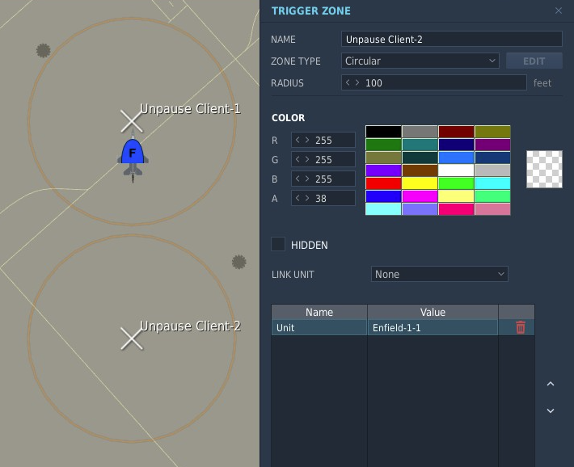
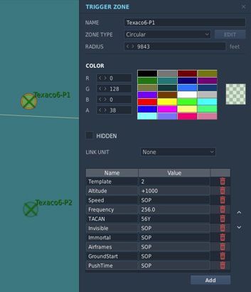

# 51st VFW MapSOP Script
## Overview
**51st MapSOP** is a MOOSE-based Lua script to assist with creation of [51st VFW SOP](https://github.com/51st-Vfw/MissionEditing-Index/blob/master/documentation/missionsEditingSOPs.md)-compliant missions.

**MapSOP** does the following:
* Deploys Tanker and AWACs flights that set radio frequencies, TACANs, altitude, and speed in accordance with 51st VFW SOPs. Orbit endpoints are defined by creating named trigger zones in the DCS Mission Editor. When the on-station Tanker/AWACS flights get low on fuel, a relief flight is automatically launched from the designated support airbase. When the relief flight arrives on-station, the original flight checks-out and RTBs.
* Sets the radio frequency and TACANS/ICLS/ACLS/Link4 for multiple aircraft carriers, automatically loops the carrier group's waypoints, and adds a radio F10 menu option to turn the carrier into the wind for launch and recovery operations, as well as displaying the frequencies for each carrier.
* Automatically launches and maintains a Recovery Tanker, E-2 AWACS, and a Rescue Helicopter that position themselves relative to the Carrier Group. Tanker/AWACs use SOP Radio/TACAN/Altitude/Speed.
* Restarts Tanker/Carrier TACAN/ICLS beacons every 5 minutes to ensure they keep working. Also provides an F10 menu option to reset all TACANs on demand.
* Adds a menu item for each carrier that shows frequency info and can command the tanker to turn into the wind for 30 minutes for takeoff/recovery.
* Silences land Airbase ATC by default, allows Airbase ATC to be selectively enabled.
* Overrides default pause behavior, helping to work around DCS 'connect to fresh server' bugs, and optionally allowing missions to be automatically unpaused only when certain client slot(s) are occupied.  
* Optionally, sets up the [MOOSE MANTIS](https://flightcontrol-master.github.io/MOOSE_DOCS_DEVELOP/Documentation/Functional.Mantis.html) or [Skynet](https://github.com/walder/Skynet-IADS) IADS networks for Red. With MANTIS, engaugement areas can be defined by creating appropriately named trigger zones.

## Setup
***(Note: All Zone/Unit names are case-sensitive.)***
1. In the DCS Mission Editor Triggers menu, load the `MOOSE _Moose.lua` and `51stMapSOP.lua` scripts with '*DO SCRIPT FILE*' on '*MISSION START*': 
2. **(OPTIONAL)** If you wish to use **Skynet** instead of MOOSE's **MANTIS** for IADS, load the MIST and *Skynet* scripts from the [Skynet Github Repo](https://github.com/walder/Skynet-IADS) under *'demo-missions'* before 51stMapSOP.lua as shown: 

    

3. **(OPTIONAL)** By default, MapSOP will pause the server after 30 second of mission time (or after a period when no client units are alive), and unpause it when any client slots into an aircraft. 

    Optionally, Trigger Zone(s) starting with `Unpause Client` can be created. An 'Unpause Client' zone created over a 'Client' aircraft unit(s) will cause the mission to only automatically unpause when an aircraft unit in such a Zone slots in. Instead of placing such a zone over a unit, a property called `Unit` can be created in an 'Unpause Client' zone with its value set to the name of an aircraft unit to trigger unpause when slotted. This is helpful for selecting individual units when units are stacked on top of each other, such as when onboard an aircraft carrier.

    The property `PauseAfter` can also be added to an 'Unpause Client' Zone and given a number value. This will pause the server after the PauseAfter number of seconds instead of the default '30'. Setting a PauseAfter value of '0' will disable automatic mission pausing altogether.
    
    
    
    ***NOTE:*** Due to DCS limitations, the DCS Server must be set to `Resume on load` under 'Advanced Options' for the unpause feature to work correctly.
    
    
    

4. **(OPTIONAL)** Enable AI ATC. By default MapSOP disables all AI ATC for land airbases. To re-enable AI ATC for an airbase, create one or more zones starting with a name starting with `Enable ATC` over the Airbase(s) to enable it. 

    
5. **(OPTIONAL)** designate the home airbase for Tanker and AWACS flights be creating a Trigger Zone called `Support Airbase` (BlueFor) or `Red Support Airbase` (RedFor) over an airbase:

    

    If no 'Support Airbase' Trigger Zone is designated, a default will be used based on the map:
    | **Map**          | **Default Support Airbase** |
    | ---------------- | --------------------------- |
    | Caucasus         | Batumi                      |
    | Mariana Islands  | Andersen                    |
    | Nevada           | Nellis                      |
    | Syria            | Incirlik                    |
    | Persian Gulf     | Al Dhafra                   |
6. Enable Tanker and AWACS flights by creating two Trigger Zones for each desired flight to mark the racetrack endpoints. The Trigger Zones should start with the callsign of the flight, and end with -P1 and -P2, for example **Texaco1-P1** and **Texaco2-P2** -- see the following table for the list of supported flights:
    | **Flight**       | **Type**                    | **Point 1**  | **Point 2**  |
    | ---------------- | --------------------------- | ------------ | ------------ |
    | Texaco1          | Boom Tanker for F-16s       | Texaco1-P1   | Texaco1-P2   |
    | Texaco2          | Boom Tanker for A-10s       | Texaco1-P1   | Texaco1-P2   |
    | Arco1            | Probe & Drogue Tanker       | Arco1-P1     | Arco1-P2     |
    | Arco2            | Probe & Drogue Tanker       | Arco2-P1     | Arco2-P2     |
    | Overlord1        | AWACS                       | Overlord1-P1 | Overlord1-P2 |
    | Magic1           | (Carrier*) AWACS            | Magic1-P1    | Magic1-P2    |
    | Shell1           | (Carrier*) S-3B Tanker      | Shell1-P1    | Shell1-P2    |
    * Presence of -P2 zone for a Carrier AWACS/Tanker will prevent auto creation of auto-creation of carrier-following flights for the cooresponding callsign.

    
7. **(OPTIONAL)** SOP flight parameters can be overridden in two different ways.

    ***The original method*** is to add specially named parameters to the -P1 Trigger zone for a callsign, for example, a Trigger Zone named `Texaco1-FL230-P1` in conjunction with a `Texaco-P2` Trigger Zone will create a Texaco1 tanker flight according to the SOP, **except** that the altitude will be overridden to 23k feet.

    The speed and altitude allow for a special additional syntax that allows adding lowercase  **p** (plus/addition) or **m** (minus/subtraction) immediately after **FL** or **SP** to add or subtract from the SOP values.  For example, a trigger zone named `Texaco1-FLp30-SPm50-P1` would override the speed and altitude SOP values for Texaco1 by adding (**p**) 3k feet to the SOP altitude, and subtracting (**m**) 50 knots from its orbit speed.

    Overrides for each callsign are processed in numerical order, so if `Texaco1-FLp30-P1` and `Texaco2-T1-P1` Zones were both present, *Texaco2* would also inherit the `FLp30` flight level override from *Texaco1*
    Prepending RED- to both P1 and P2 trigger zones will spawn a RedFor (Combined Joint Task Force Red) version of the flight. 

    Consult the table below for the complete list of SOP override paramters:

    | **Parameter**           | **Notation** | **Example**               | **Effect**                                           |
    |-------------------------|--------------|---------------------------|------------------------------------------------------|
    | Flight SOP base template|T***n***      |Texaco3-T***2***-P1        |Override all SOP values to those of Texaco***2***     |
    | Orbit Altitude          |FL***n***     |Texaco1-FL***230***-P1     |Override Texaco1 orbit altitude to 23k feet           |
    | Increase Orbit Altitude |FLp***n***    |Texaco1-FLp***30***-P1     |Increase Texaco1 orbit altitude by 3k feet from SOP   |
    | Decrease Orbit Altitude |FLm***n***    |Texaco1-FLm***30***-P1     |Decrease Texaco1 orbit altitude by 3k feet from SOP   |
    | Orbit Speed             |SP***n***     |Texaco1-SP***400***-P1     |Override Texaco1 orbit speed to 400 KIAS              |    
    | Increase Orbit Speed    |SPp***n***    |Texaco1-SPp***50***-P1     |Increase Texaco1 orbit altitude by 50 knots           |
    | Decrease Orbit Speed    |SPm***n***    |Texaco1-SPm***50***-P1     |Decrease Texaco1 orbit altitude by 50 knots           |
    | Set Radio Frequency     |FR***nnn.nn***|Texaco1-FR***256.00***-P1  |Override Texaco1 radio setting to 256.00 MHz AM       |
    | Set TACAN Freq/Band     |TC***nnY***   |Texaco1-TC***56Y***-P1     |Override Texaco1 TACAN to 56Y                         |
    | Make invisible to AI    |INV           |Texaco1-INV-P1             |Makes Texaco1 invisible to the AI                     |
    | Limit available flights |QTY***n***    |Texaco1-QTY***4***-P1      |Limits Texaco1 to ***4*** spawns during the mission   |
    | Initial ground start    |GND           |Texaco1-GND-P1             |Makes initial Texaco1 takeoff from support Airbase    |
    | Spawn flight as RedFor* |RED-          |RED-Texaco1-P1             |Spawns flight as RedFor. RED- must be prefix.         |
    * Remember to override Radio/TACAN settings to avoid overlap with cooresponding BlueFor flights.

    ***The new method*** is to add special Properties to the -P1 zone for the Tanker/AWACS. A property set to 'SOP' will be ignored.
    
    | **Parameter**           | **Zone Parameter**   | **Example Value** | **Effect**                                           |
    |-------------------------|--------------|---------------------------|------------------------------------------------------|
    | Flight SOP base template|Template      |***2***                    |Override all SOP values to those of Texaco***2***     |
    | Orbit Altitude          |Altitude      |***23000***                |Override Texaco1 orbit altitude to 23k feet           |
    | Increase Orbit Altitude |Altitude      |***+3000***                |Increase Texaco1 orbit altitude by 3000 feet from SOP |
    | Decrease Orbit Altitude |Altitude      |***-3000***                |Decrease Texaco1 orbit altitude by 3000 feet from SOP |
    | Orbit Speed (KIAS)      |Speed         |***400***                  |Override Texaco1 orbit speed to 400 KIAS              |    
    | Increase Orbit Speed    |Speed         |***+50***                  |Increase Texaco1 orbit altitude by 50 knots           |
    | Decrease Orbit Speed    |Speed         |***-50***                  |Decrease Texaco1 orbit altitude by 50 knots           |
    | Set Radio Frequency     |Frequency     |***256.00***               |Override Texaco1 radio setting to 256.00 MHz AM       |
    | Set TACAN Freq/Band     |TACAN         |***56Y***                  |Override Texaco1 TACAN to 56Y                         |
    | Make invisible to AI    |Invisible     |***true***                 |Makes Texaco1 invisible to the AI                     |
    | Limit available flights |Airframes     |***4***                    |Limits Texaco1 to ***4*** spawns during the mission   |
    | Initial ground start    |GroundStart   |***true***                 |Makes initial Texaco1 takeoff from support Airbase    |
    * Setting the value **SOP** for any value will use the SOP value for the flight/template as if the property was not present. 

8.  **(OPTIONAL)** Additional flights beyond those specified in the SOP can be created by specifying additional -P1 and -P2 trigger with a name cooresponding to the callsign of the new flight. All values will default to the SOP settings of the **1** callsign with the same name (Texaco1/Acro1/Shell1/Overlord1/Magic1).  

    ***NOTES:***
      - Additional Shell/Magic callsigns will operate from the land airbase using -P1 and -P2 endpoints instead of following the carrier.
      - Off-duty Tankers/AWACS will use a -8 flight callsign, and set TACAN to 58Y.

    The -T***N***- zone name parameter or ***Template*** zone property can be used to default to the SOP values from another flight, see the table above.

    To avoid collisions with SOP values, parameter overrides should be used to override relevant SOP settings. For example, a Texaco3 flight might be created using the following -P1 Trigger Zone (and an accompanying **Texaco3-P2** Trigger Zone):
        
    `Texaco3-T2-FLp10-SP375-FR256.0-TC56Y-P1`

    The same settings could be configured by setting the value Zone Properties / Values in a `Texaco3-P1` zone
    |***Property***  |***Value*** |
    |----------------|------------|
    |Template        | 2          |
    |Altitude        | +1000      |
    |Speed           | 375        |
    |Frequency       | 256.0      |
    |TACAN           | 56Y        |

    This creates a 'Texaco3' tanker flight starting with the Texaco2 SOP values, but lowers orbit altitude by 1000 feet, sets orbit speed to 375 knots, sets the radio to 256.0 MHz, and sets TACAN to 56Y.

9. To add Aircraft Carrier support, name the carrier **unit** with the hull number of the carrier, for example `CVN-75`.  The Tarawa `LHA-1` is supported for TACAN only.  This will set up Radio, TACAN, and ICLS for the carrier, loop the waypoints of the carrier group, and launch recovery tanker, AWACS, and rescue helicopter flights around the carrier group.  This will also enable an Radio F10 menu option to turn the carrier into the wind for takeoff and recovery.
 
    
    

10. IADS:

    1. Name Red SAM groups a name starting with `Red SAM`, and if using *MANTIS* (Skynet not loaded) include the name of the SAM system (one SAM system type per group). Valid SAM system names for *MANTIS* are as follows *(case sensitive)*:
        * Avenger
        * Chaparrel
        * Hawk
        * Linebacker
        * NASAMS
        * Patriot
        * Rapier
        * Roland
        * SA-2, SA-3, SA-5, SA-6, SA-7, SA-8, SA-9, SA-10, SA-11, SA-13, SA-15, SA-19
    
        With *MANTIS*, short-range systems like the SA-15 will automatically work as SHORAD point defense if positoned near other SAM groups.

        

        ***NOTE:*** If no groups includes the name `Red SAM`, no IADS system will be initialized to save server resources. 

    2. Name Red early warning radar groups with a name starting with `Red EWR`:

        

    3.  **(OPTIONAL)** If using *Skynet*, you can configure point defense units by adding a `DO SCRIPT` (or `LOAD SCRIPT FILE`) action after loading `51stMapSOP.lua` that assigns a point defense group to a SAM or EWR -- the *Skynet* object is called `RedIADS`:
        ```lua
        --first get the SAM site you want to use as point defence from the IADS:
        local sa15 = RedIADS:getSAMSiteByGroupName('RED SAM SA-15-1')
        --then add it to the SAM site it should protect:
        RedIADS:getSAMSiteByGroupName('RED SAM SA-10-1'):addPointDefence(sa15)
        ```
    
    4. **(OPTIONAL)** If using *MANTIS* (*Skynet* has not not loaded), you may create Trigger Zones starting with `Red IADS Accept`, `Red IADS Reject`, or `Red IADS Conflict` to designate *MANTIS* Accept, Reject, or Conflict Zones that limit where the IADS network will consider targets for engaugement. Reference the [MANTIS](https://flightcontrol-master.github.io/MOOSE_DOCS_DEVELOP/Documentation/Functional.Mantis.html##(MANTIS).AddZones) documentation for details.

    5. **(OPTIONAL)** If you want a Red AWACS unit(s) to act as a EWR, name or start AWACS group name(s) with `Red EWR AWACS`.

---

## Version History

*Version 20220101.1*
* Blackdog initial version

*Version 20220115.1*
* Fix: Tanker speeds adjusted to be close KIAS from SOP + better starting altitudes.

*Version 20220123.1*
* Fix: Unit orbit endpoints longer offset from orbit endpoint zone locations.
* Fix: Carriers/LHA now set their assigned radio frequencies.
* Fix: Tankers/AWACs relief launched at 25-35% fuel instead of testing value of 80-90%.
* Allow 'extra' Tankers/AWACS flights not in SOP to be spawned via Trigger Zones.
* Allow limiting the number of Tankers/AWACS spawns per flight via -P1 Zone name parameters.
* Allow override of SOP parameters via -P1 Zone name parameters.
* Allow relative adjustment of SOP FL/Airspeed via -P1 Zone name parameters.
* Allow setting Tanker/AWACS invisible via -P1 Zone name parameter.
* IADS completely disabled if no group names with 'Red SAM'.

*Version 20220213.1*
* No carrier F10 menu without a carrier.

*Version 20220221.1*
* Package MOOSE devel from 2022-02-21 for DCS NTTR Airport name changes.

*Version 20220227.1*
* Add Carrier STC/TACAN/ICLS info to comms/F10 carrier menu.

*Version 20220327.1* 
* Updated MOOSE version (updates for DCS changes)
* Fix: Bug that may have prevented Red AWACS for operating as part of MANTIS IADS network.
* Fix: Ensure parameter override inheritance consistent, and document this behavior.
* Add 'GND' Zone name parameter to make AWACS/Tanker initially ground start.
* Prevent 'auto' creation of Carrier AWACS/Tanker if -P2 zone with same name.

*Version 20220526.1* 
* Multi-carrier support / new 51st carrier support unit SOPs.
* Same info as Hornet carrier kneeboard for each carrier via F10 carrier control menu.
* Support new carrier Link4/ALCS.
* Carrier control F10 menu now "Blue Only" and new formatting.
* Rescue helo for LHA.
* Ground start (no air respawn) honored for 'GND' Zone parameter for carrier support units.
* Create RedFor versions of non-carrier Tankers/AWACS via "RED-" prefix P1/P2 zones.
* Carrier wind speed at 15M not 50M (replicating AIRBOSS fix in MOOSE).

*Version 20220604.1*
* Fix Magic5 AWACS (CVN-75).
* Fix rescue helo for CVNs.

*Version 20220611.1*
* Force callsign resets every 5 minutes (possibly address apparent callsign bug).

*Version 20220727.1* 
* Undo unsucessful change from 20220611.1
* Fix 'All tankers Acro 1-1' bug by working around DCS issue.
* Fix non-AWACS in AWACS radio menu.
* Fix aircraft spawning without velocity; now spawn in at 350kts @ +5k ft of dest altitude.
* Aircraft spawn offset a bit from their initial destination to smooth initial flight.
* Tanker/AWACS speed now actually ~KIAS (changes w/ assigned altitude), table speeds adjusted.
* After being relieved, AWACS/Tanker flights change their callsign number to '9' and get off freq.
* Limited airframes become available to launch again ~1 hour after landing (maint/refueling).
* Tested/included MOOSE version bump.

*Version 20220915.1* 
* Option to use Zone properties instead of zone naming to set Tanker/AWACS SOP overrides.
*  Airbase ATC silenced by default, enabled by putting Airbase inside an 'Enable ATC' zone(s).
*  Server pause control.
*  AWACS/Tanker get to their orbits much faster when air spawned.
*  Changed 'off duty' Tanker/AWACS callsign flight number to -8 (instead of 9).
*  'Off duty' Tankers use 58Y (Viper TACAN freezes if you turn a Tanker TACAN off).
*  Use new native MOOSE function for Link4 activation.
*  Tested/included MOOSE version bump.

*Version 20220917.1*
* Eliminated mysterious aircraft disappearances (remove MOOSE cleanup at SupportBase)
* Greatly reduced naval rotary aviation accidents (only one helo spawn on carriers) 

### Known issues:
* Extra Non-SOP Shell/Magic units act like land-based Tankers/AWACS.
* Off-duty tankers/AWACS show up in radio menu under -8 callsigns.
* ACLS does not work for CVN-70 (USS Carl Vincent, apparently not a 'real' DCS SuperCarrier).
