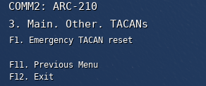
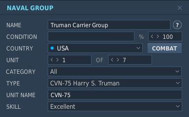
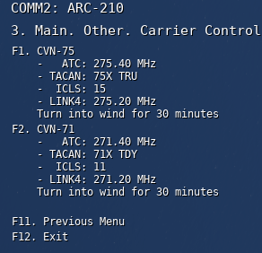

# 51st VFW MapSOP Script
## Overview
**51st MapSOP** is a MOOSE-based Lua script to assist with creation of [51st VFW SOP](https://github.com/51st-Vfw/MissionEditing-Index/blob/master/documentation/missionsEditingSOPs.md)-compliant missions.

**MapSOP** does the following:
* Deploys Tanker and AWACs flights that set radio frequencies, TACANs, altitude, and speed in accordance with 51st VFW SOPs. Orbit endpoints are defined by creating named trigger zones in the DCS Mission Editor. When the on-station Tanker/AWACS flights get low on fuel, a relief flight is automatically launched from the designated support airbase. When the relief flight arrives on-station, the original flight checks-out and RTBs.
* Sets the radio frequency and TACANS/ICLS for Aircraft Carriers, automatically loops the Carrier group's waypoints, and adds a radio F10 menu option to turn the carrier into the wind for launch and recovery operations.
* Automatically launches and maintains a Recovery Tanker, E-2 AWACS, and a Rescue Helicopter that position themselves relative to the Carrier Group. Tanker/AWACs use SOP Radio/TACAN/Altitude/Speed.
* Restarts Tanker/Carrier TACAN/ICLS beacons every 5 minutes to ensure they keep working. Also provides an F10 menu option to reset all TACANs on demand.

  
* Sets up the [MOOSE MANTIS](https://flightcontrol-master.github.io/MOOSE_DOCS_DEVELOP/Documentation/Functional.Mantis.html) or [Skynet](https://github.com/walder/Skynet-IADS) IADS networks for Red. With MANTIS, engaugement areas can be defined by creating appropriately named trigger zones.

## Setup
***(Note: All Zone/Unit names are case-sensitive.)***
1. In the DCS Mission Editor Triggers menu, load the MOOSE include the _Moose.lua script with DO SCRIPT FILE on MISSION START: 
2. **(OPTIONAL)** If you wish to use **Skynet** instead of MOOSE's **MANTIS** for IADS, load the MIST and *Skynet* scripts from the [Skynet Github Repo](https://github.com/walder/Skynet-IADS) under *'demo-missions'* as shown: 

    

3. Use the ONCE trigger with Time More condition to load the 51stMapSOP.lua after 5 seconds: 
4. **(OPTIONAL)** designate the home airbase for Tanker and AWACS flights be creating a Trigger Zone called `Support Airbase` over an airbase:

    

    If no 'Support Airbase' Trigger Zone is designated, a default will be used based on the map:
    | **Map**          | **Default Support Airbase** |
    | ---------------- | --------------------------- |
    | Caucasus         | Batumi                      |
    | Mariana Islands  | Andersen                    |
    | Nevada           | Nellis                      |
    | Syria            | Incirlik                    |
    | Persian Gulf     | Al Dhafra                   |
5. Enable Tanker and AWACS flights by creating two Trigger Zones for each desired flight to mark the racetrack endpoints. The Trigger Zones should start with the callsign of the flight, and end with -P1 and -P2, for example **Texaco1-P1** and **Texaco2-P2** -- see the following table for the list of supported flights:
    | **Flight**       | **Type**                    | **Point 1**  | **Point 2**  |
    | ---------------- | --------------------------- | ------------ | ------------ |
    | Texaco1          | Boom Tanker for F-16s       | Texaco1-P1   | Texaco1-P2   |
    | Texaco2          | Boom Tanker for A-10s       | Texaco1-P1   | Texaco1-P2   |
    | Arco1            | Probe & Drogue Tanker       | Arco1-P1     | Arco1-P2     |
    | Arco2            | Probe & Drogue Tanker       | Arco2-P1     | Arco2-P2     |
    | Overlord1        | AWACS                       | Overlord1-P1 | Overlord1-P2 |

    
6. To add Aircraft Carrier support, name the carrier **unit** with the hull number of the carrier, for example `CVN-75`.  The Tarawa `LHA-1` is supported for TACAN only.  This will set up Radio, TACAN, and ICLS for the carrier, loop the waypoints of the carrier group, and launch recovery tanker, AWACS, and rescue helicopter flights around the carrier group.  This will also enable an Radio F10 menu option to turn the carrier into the wind for takeoff and recovery.
 
    
    

7. IADS:

    1. Name Red early warning radar groups with a name starting with `Red EWR`:

        

    2. Name Red SAM groups a name starting with `Red SAM`, and if using *MANTIS* (Skynet not loaded) include the name of the SAM system (one SAM system type per group). Valid SAM system names for *MANTIS* are as follows *(case sensitive)*:
        * Avenger
        * Chaparrel
        * Hawk
        * Linebacker
        * NASAMS
        * Patriot
        * Rapier
        * Roland
        * SA-2, SA-3, SA-5, SA-6, SA-7, SA-8, SA-9, SA-10, SA-11, SA-13, SA-15, SA-19
    
        With *MANTIS*, short-range systems like the SA-15 will automatically work as SHORAD point defense if positoned near other SAM groups.

        

    3.  **(OPTIONAL)** If using *Skynet*, you can configure point defense units by adding a `DO SCRIPT` (or `LOAD SCRIPT FILE`) action after loading `51stMapSOP.lua` that assigns a point defense group to a SAM or EWR -- the *Skynet* object is called `RedIADS`:
        ```lua
        --first get the SAM site you want to use as point defence from the IADS:
        local sa15 = RedIADS:getSAMSiteByGroupName('RED SAM SA-15-1')
        --then add it to the SAM site it should protect:
        RedIADS:getSAMSiteByGroupName('RED SAM SA-10-1'):addPointDefence(sa15)
        ```
        
    
    4. **(OPTIONAL)** If using *MANTIS* (*Skynet* has not not loaded), you may create Trigger Zones starting with `Red IADS Accept`, `Red IADS Reject`, or `Red IADS Conflict` to designate *MANTIS* Accept, Reject, or Conflict Zones that limit where the IADS network will consider targets for engaugement. Reference the [MANTIS](https://flightcontrol-master.github.io/MOOSE_DOCS_DEVELOP/Documentation/Functional.Mantis.html##(MANTIS).AddZones) documentation for details.

    5. **(OPTIONAL)** If you want a Red AWACS unit to act as a EWR, name the AWACS group `Red AWACS`.


