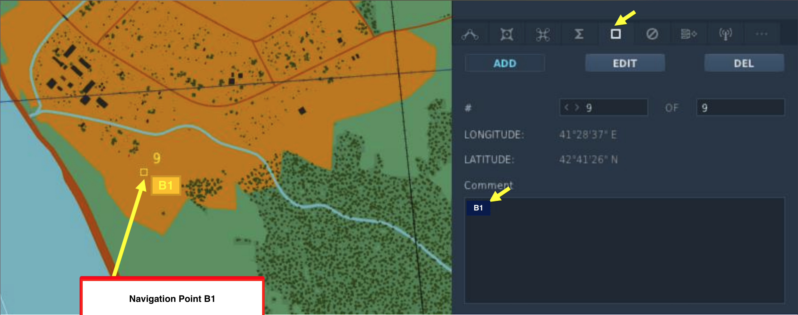

# Viggen 51st VFW Mission Editing SOPs

> This document consolidated legacy SOP content for the Viggen.

## Default Communications Plan

### Flights & Airframes

|Flight / Arirframe|TACAN|Frequency|   |Flight / Arirframe|TACAN|Frequency|
|---|:---:|:---:|---|---|:---:|:---:|
|Fjörd 1 *AJS37*|N/A|145.25|    |Fjörd 2 *AJS37*|N/A|145.75|

# Airframe Specific SOPs

## AJS37

The AJS37 Viggen is a single-seat, single-engine, short-medium range combat aircraft.

### Mission Design Guidelines for the AJS37

TODO: AJS37 design guidelines

### Comms Presets

Typically, comms presets are set up in the DCS ME according to the following table,

|Radio|Frequency|
|---:|:---|
|Special 1| Fjörd 1 Intraflight |
|Special 2| Fjörd 2 Intraflight |
|Special 3| Viggen Common or mission frequency | 
|H (Larm/Guard)| Tactical Common |

Missions may deviate from these presets as necessary.

### Navigation Points

The Viggen uses navigation markers in addition to the steerpoints assigned to each unit through
the DCS ME. There are several different types as shown in the following table,

|Symbol|Type|Numbering|Notes
|---|:---:|:---:|---|
|B|Waypoint|1-9|General waypoints, these navigation points share numbering with the M points.
|M|Target|1-9|Target points, these navigation points share numbers with the B points.
|Bx|General|1-9|General points of interest (points 1-5) and anti-ship missile programming (points 6-9).
|R|Recon|1-9|Boundary of recon area for ELINT, minimum of four points is recommended.
|MR|Recon Target|1-9|Target locations within the recon area the R points define.

Markers are numbered sequentially as shown. With the exception of B and M types, all other
types are numbered independently (for example, a flight plan could have both B1 and Bx1 but not
B1 and M1).

To add a navigation marker, use the navigation point panel (marked with a square symbol) in the
DCS ME group editor for a Viggen group as shown below.

You can add, edit, and delete navigation points with the corresponding controls. The navigation
points show up in the ME map as small squares labeled with the assigned name.

