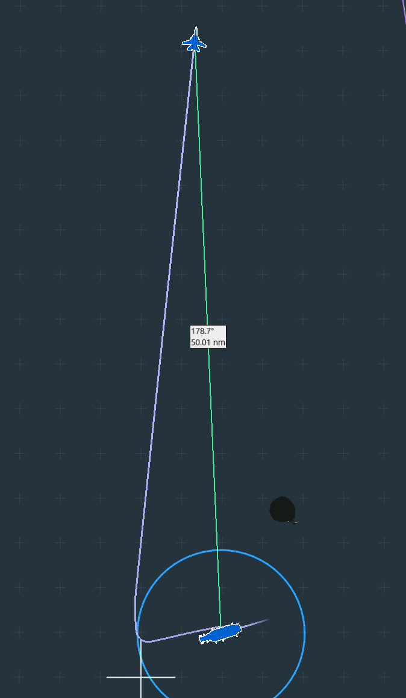
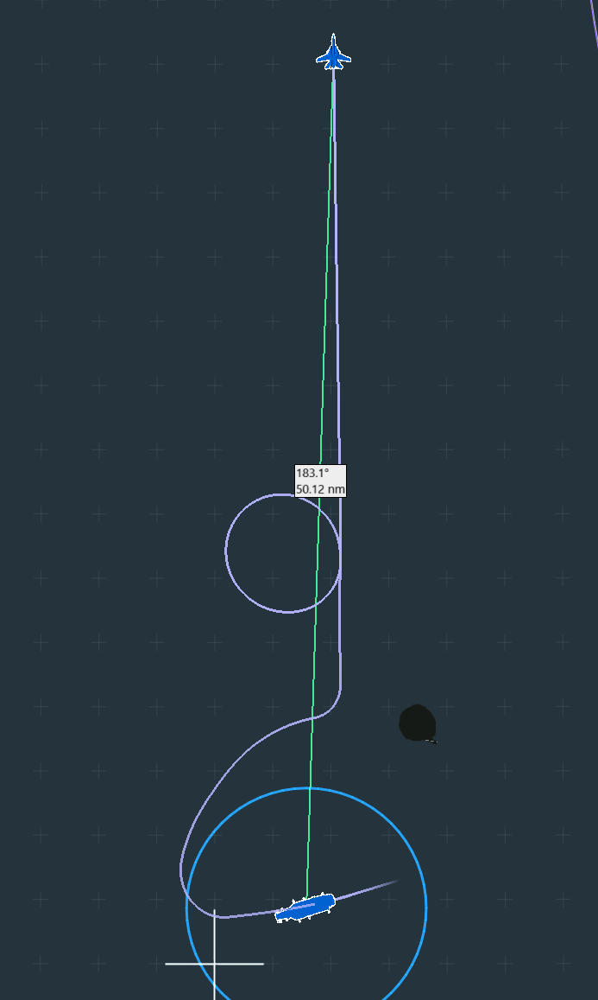
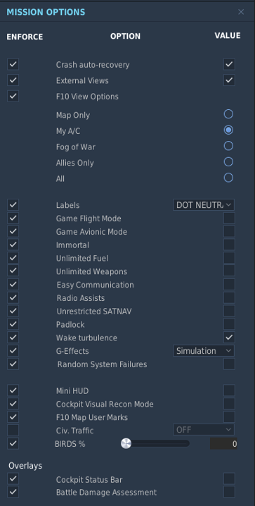
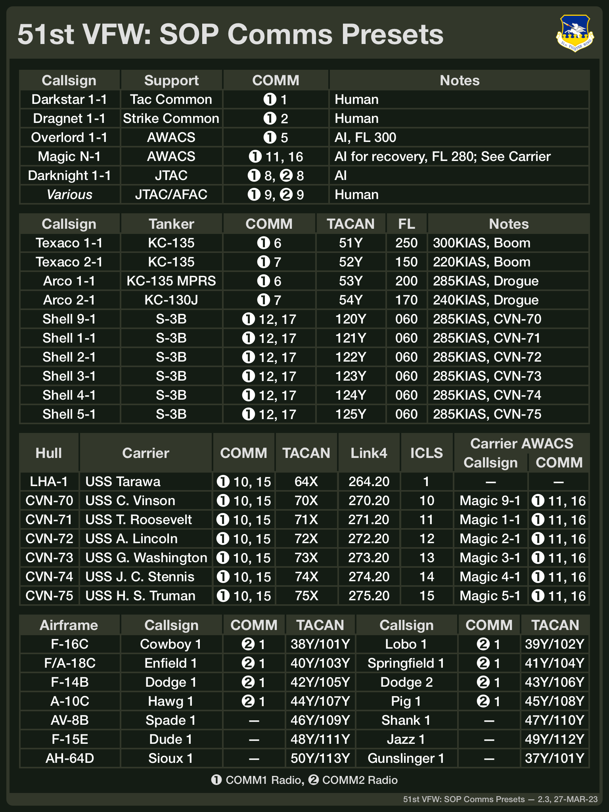

# SOP Introduction

_Revision 2.2, 8-October-2023_

This document covers a variety of topics that attempt to standardize some aspects of mission
design to reduce the workload on mission designers and pilots.

- [Mission Design SOPs](#Mission-Design-SOPs) covers guidelines for mission design.
- [Mission Setup SOPs](#General-51st-VFW-Mission-Setup-SOPs)
  covers general setup topics such as communications, tankers, TACAN, etc.
- [Airframe Specific SOPs](#Airframe-Specific-SOPs)
  covers material specific to an airframe such as mission design guidelines or radio setup.

SOPs are defined for all of the airframes the wing supports including: A-10C II (legacy
A-10C version is _not_ supported), AH-64D, F-15E, F-16C, and F/A-18C.

> The SOPs are intented to be _guidelines_ to provide a starting point for mission designers.
> While mission designers have the ultimate say based on the needs of their mission, we
> encourage the use of the SOPs where ever it makes sense to reduce the workload on the
> designer (for example, by eliminating the need to develop a full comms plan) and pilots
> (for example, by allowing comms environments to be familiar from mission to mission).

# Mission Design SOPs

This section covers a number of general topics in mission design and provides information that
may be helpful in conceptualizing and building a mission.

## Startup and Launch Timeline

The mission design should be conscious of the amount of time it takes for the pilots in the
mission to slot and depart on the mission proper. As different airframes have different
timelines for getting from slotting to ready, this can lead to coordination issues depending
on the mission design.

> Generally, keep in mind that the process of getting everyone in a mission and in the air
> is bound to run into snags due to unexpected system issues or glitches that may require
> some participants to re-slot or entirely restart DCS.

There are a number of ways the mission designer can attempt to align schedules, for example,

- Have faster groups slot later (perhaps they are allowed a longer pre-mission brief)
  than slower groups.
- Hold faster groups on the ground until slower groups are ready.
- Add tasking or sequencing in the mission that relies on the faster group being ready
  sooner. For example, the mission might task faster groups with early destruction of enemy
  defenses to enable slower groups to perform their tasking.
- Break a larger mission into smaller focused missions where tasking chains can be broken.
  For example, break a SEAD+Strike mission into separate SEAD and Strike missions where the
  outcome of the SEAD mission impacts the environment in which the Strike mission takes place.

This list is not exhaustive.

The discussion will consider typical timelines for several aircraft to provide some insight
into the potential challenges that a designer may need to address. In the following material
keep in mind that factors such as disconnects or technical issues can also influence the time
it takes to reach a ready state.

### Sea-Based Naval Airframes

The following example describes the F-14B. Other naval airframes are assumed to follow similar
timelines.

The timeline is broken up into a start up phase that takes the jet from cold to on the catapult
followed by a departure phase from departure to an initial waypoint.

In the start up phase, pilots slot and get their jet ready to launch. Due to the limited space
on the deck, jets start and get their INS aligned before moving to another spot on the deck to
clear the spawn points.

|Event|Time|Notes|
|:---:|:---:|---|
|Slot and align INS| T + 0:05-0:07|
|Repark and Rearm| T + 0:09-0:11| May be necessary only with more than 8 pilots.
|Take Catapult, Launch| T + 0:12-0:14|

In DCS, the carrier module is limited to 8 spawn points on the deck. Aircraft must move off
these spawn points before additional pilots can slot in. As a result, when more than 8 pilots
are attached to a carrier, their slotting must happen in waves which will stagger the
availability of airframes (that is, those in the first group of pilots that slot may be ready
around ten minutes before the second group). Generally, this is done by having pilots start
their jets, perform INS alignment, and then move to a staging area on the carrier to
allow others to slot in. While in the staging area, pilots can finish startup and rearming as
needed before heading to the catapults for depatrure.

Departure procedures for naval units depend on conditions such as weather and time of day at
launch. There are two departure classes,

- CASE-1 for day VFR operations involves extending 7nm from the carrier, then turning on course
  to an initial waypoint. In CASE-1, it may be possible to launch aircraft in rapid succession
  from the catapults (with some limitations noted below).
- CASE-3 for night or IFR operations involves extending 7nm from the carrier and flying a DME
  arc to a CV rendezvous point where the aircraft rejoin before turning on course to an initial
  waypoint. In CASE-3, aircraft are launched one at a time at 30-60s intervals.

The following figure illustartes an overhead view of a CASE-1 departure.

As this departure is straight-forward, it's timeline is simple to reach an initial waypoint
50nm from the carrier at an altitude of 35K MSL (note this picks up where the start up timeline
left off),

|Event|Time|Notes|
|:---:|:---:|---|
|Extend to 7nm, direct WP1| T + 0:20-0:22|In cruise at angels 35 by WP1

A CASE-3 depature looks like this,

The timeline under this departure is slightly more complicated.

|Event|Time|Notes|
|:---:|:---:|---|
|Extend to 7nm, 10 DME arc|T + 0:18-0:20|Arc to outbound departure radial
|Fly to CV rendezvous, single orbit|T + 0:23-0:25|More orbits may be necessary if slow to join or many jets are gathering
|Fly to WP1|T + 0:26-0:28|In cruise at angels 35 by WP1

In CASE-3 conditions then, it could take almost 30 minutes for the first aircraft to reach an
initial waypoint 50nm from their carrier. Roughly speaking, in the first wave of 8 slots, you
can expect 2-ship sections to get airborne and reach WP1 roughly every two to four minutes.

> For the Tomcat, the ED Super Carrier limits at most to two Tomcats on the catapults at the
> same time. CASE-1 can still shoot in tighter intervals than in CASE-3, but it still takes the
> same amount of time to hook up two more jets to launch. As a result, even in CASE-1
> conditions you are likely limited to putting up a 2-ship section every three minutes, same as
> CASE-3.

### Ground-Based Airframes

Ground-based aircraft do not face the space constraints present on a carrier. Because parking
is not at a premium, there is no need to sequence slotting as there may be for naval units.
This allows ground-based airframe to get in the air more rapidly.

Unlike a carrier, taxi time may be important depending on the airfield and location on the
airfield that the mission locates its jets in. Mission design will need to consider carefully
how to handle that aspect of unit positioning. In practice, long taxi times may not necessarily
be a bad thing as it may effectively "hide" some of the longer timelines for other units.

For an F-16C, typically ten minutes should be sufficient for slot to wheels up. Using hot jets
or populating the loadout in the mission editor can accelerate this timeline a little if the
mission needs more rapid availability.

## Communications in a Contested Environment

When using PvP elements in a mission, the mission designer is responsible for setting the
ground rules for denial or monitoring of communications by enemy forces. DCS can support
communications tactics such as,

- Denial of communications by "jamming" enemy communications (e.g., by broadcasting noise
  over a known enemy frequency).
- Monitoring of enemy communications by monitoring a known enemy frequncy for information.
- Disruption of enemy communications by passing bad information on a known enemy
  frequency.

DCS also supports mitigations to these tactics such as encrypted communications, multiple
frequencies, etc. Typically, 51st VFW servers are set up to allow all of these tactics.

- _Encryption_ - Many airframes support encrypted communications to secure communications.
  Keys for encrypted communications are assumed to be secret (though DCS only models fixed
  keys that are effectively not secret) which implies that encryption will prevent denial,
  disruption, or monitoring of an encrypted frequency even if it is known to the enemy.
- _Brevity_ - To obfuscate information, a coalition may elect to use brevity to communicate
  key events. This may make it more difficult for an enemy to gain information by monitoring
  a knonwn frequency or disrupt by providing false information on a frequency.
- _Backups_ - A coalition may define a set of frequencies for a particular purpose (e.g.,
  tactical common, inter-flight) that it will switch between under known circumstances
  (e.g., if communications are compromised, every N minutes).

As DCS AI does not perform any of these tactics, these considerations primarily apply to
missions that include a PvP element where red, for example, could potentially employ these
techniques to gain an advantage over blue if they know or figure out a blue frequency. The
mission designer should be clear on what is allowed and rely on the honor system for players
to stay within the rules.

> This document does not include information on how to employ these technicques and
> mitigations. See the manuals for specific airframes for information on how to set up
> encryption on the airframe's radios, for example.

There are basically three sets of rules a PvP mission can adopt,

- _Uncontested Comms_ - Players are prohibited from denying, disrupting, or monitoring
  enemy communications.
- _Contested Comms, No Disruption_ - Players may monitor known enemy frequencies that are
  in the clear (i.e., not encrypted) but are prohibited from disrupting or jamming those
  frequencies.
- _Contested Comms_ - Players are free to use tactics that monitor, deny, or disrupt
  enemy communications on frequencies that are in the clear.

The specific boundaries must be communicated to the players during perparation, planning,
and briefing so coalitions can develop communications plans to deal with the potential
threats that are within the boundary of the mission.

Note that there is tension between the goals of these SOPs (reducing the effort necessary to
set up a mission, providing consistency for pilots from mission to mission) and secure
communications. Fully embracing secure communications would imply that _all_+ frequencies are
changed _every_ mission and there is no "SOP" for tactical common, a tanker, JTAC, etc. We
expect the mission designer to balance this appropriately. Scrambling comms every mission
adds a lot of work (mission setup, comms card reuse, etc.) without providing much value in
PvE missions, for example.

# Mission Setup SOPs

This section covers a number of standard operating procedures (SOPs) mission designers should
employ around general mission elements such as communications, navigation, and operational
support. These SOPs are built around the airframes the 51st VFW currently supports: A-10C II,
AH-64D, F-15E, F-16C, F/A-18C, and other helicopter airframes.

> The SOPs support the new DCS A-10C module (`A-10C_2`), not the legacy module (`A-10C`).

Missions should follow the SOPs where possible and practical to provide consistency across
51st VFW missions. That being said, mission designers are always free to deviate from these
guidelines where ever necessary due to the specific mission scenario or goals.

## DCS Mission Editor Mission Options

The following are the suggested SOP mission options for use in the DCS Mission Editor.

Unrestricted SATNAV is set to allow REDFOR to use NATO aircraft by default.

## TACAN Channel Usage Guidelines

TACAN channels in the mission should be assigned consistent with the following diagrams. The
first diagram (taken from a discussion of TACAN usage in the Hornet from the ED DCS forums)
establishes the baseline availability of TACAN channels in DCS.

Channels marked "unavailable" or "degraded" should be avoided. Based on these constraints,
the following figure shows the default assignments for TACAN channels that the SOPs use.

Further details on the default assignments are covered below in the discussions of the
communications plan and airframe SOPs and are consistent with these assignments.

When a mission needs additional TACAN channels, the designer is encouraged to select an
unallocated channel rather than re-purpose an channel that the SOP defines a use for.

## Tanker Altitude and Airspeed Guidelines

This thread from the [ED DCS Forums](https://forums.eagle.ru/topic/260542-looking-for-actualrecommened-aerial-refueling-speeds/)
discusses tanker altitude and airspeed guidelines for AAR units based on the the KC-135
airframe. The following table summarizes the guidelines relevant to the airframes that
the 51st VFW operates.

|Airframe|Speed (KIAS)|Altitude|Notes|
|---|:---:|:---:|---|
|A-10C|220|FL150|
|F-15E|315|FL300|Source has no data, assumed to match F-16C
|F-16C|315|FL300|
|F/A-18C|275-285|FL300|

The 51st VFW SOPs track these guidelines with some adjustments as our missions may use
airframes other than the KC-135 for AAR tasking or perfer different altitudes.

The following table lists the full set of tankers that might be found in a mission along with
the default altitude and airspeeds the 51st VFW SOPs assume. A specific mission need not
provide all of these tankers and may deviate from these speeds (though missions should attempt
to provide speeds with 10-20kt of these speeds). As the DCS Mission Editor specifies route
speeds using ground speed, not KIAS, the following table lists the ground speeds necessary in
the DCS Mission Editor to achieve the default KIAS at the default altitude in calm conditions.

|Tanker|Airframes  (ppm xfer rate)|Altitude|Speed (KIAS)|Speed (GS, ME)|Purpose|
|---|:---:|:---:|:---:|:---:|---|
|KC-135|F-16C(2,857)  F-15E|FL250|300|475|Probe & Boom High Speed
|KC-135|A-10C(1,578)|FL150|220|276|Probe & Boom Low Speed
|KC-135 MPRS|F/A-18C(2,857)|FL200|285|384|Probe & Drogue Low Speed
|KC-130J|AV8-B|FL170|240|336|Probe & Drogue Low Speed
|S-3B Tanker|F/A-18C|6000 MSL|285|309|Carrier

Other airframes should be able to use one of these tankers.

> Keep in mind that ground speed may change based on altitude, altimiter setting, or other
> factors and may need to be adjusted accordingly in the mission editor based on the specific
> scenario.

The
[51st VFW MapSOP script](https://github.com/51st-Vfw/MissionEditing-Index/tree/master/51stMapSOP)
can help set up tankers consistent with the SOPs.

## Default Communications Plan

For consistency, missions should follow the default comms plan wherever possible. While these
defaults can support a wide range of missions, missions may deviate based on their specific
needs. Generally, the communications plan uses UHF for cross-wing communication and VHF
for communication within a flight.

> The communications plan provides the base setup for communications in the mission. It
> does _not_ include mission-specific information such as encryption or backup frequencies
> as these depend on the mission design goals. See the earlier discussion of communications
> in a contested environment above.

Both the 
[51st VFW MapSOP script](https://github.com/51st-Vfw/MissionEditing-Index/tree/master/51stMapSOP)
as well as
[51st VFW Mission Templates](https://github.com/51st-Vfw/MissionEditing-Templates)
are set up to align with these SOPs.

The following sections focus on specific pieces of the overall comms plan.

### ATC Frequencies

ATC frequencies (tower, ground, CTAF, ATIS, etc.) are set according to the published charts
for the airports in theater. We will typically use frequencies in military UHF/VHF bands as
appropriate. Where published charts are unavailable, a mission may fill in any missing
frequencies as it sees fit. At controlled airfields, we will use the published tower
frequency as either tower (when AI or human ATC is available) or CTAF (otherwise).

A mission may elect to use modules such as [DATIS](https://github.com/rkusa/DATIS) to support
ATC communications.

### Support Elements

Support elements include the tactical common frequency as well as AWACS and JTAC/AFAC units
that may be present in a mission. The following table summarizes the standard communications
plan for these elements.

|Element|Frequency|Notes|   |Element|Frequency|Notes|
|---|:---:|:---|---|---|:---:|---|
|Darkstar 1-1 *Tactical Common*|270.00|Player| |Dragnet 1-1 *Strike Common*|275.00|Player
|Overlord 1-1 *AWACS*|240.00|AI FL300| |Magic *N*-1 *Carrier AWACS*|See Below|AI FL280
|Darknight 1-1 *JTAC*|138.00 238.00|AI| |Various *JTAC/AFAC*|138.10 238.10|Player

The frequencies are selected to support both human and AI in AWACS and JTAC/AFAC roles. For
AWACS/GCI, a mission that uses a human in the role would place the AWACS/GCI on the tactical
or strike common frequency. Placing AI AWACS/GCI on different frequencies prevents the AI
from flooding the radio. A mission that relies on only AI AWACS/GCI could place the tactical
common frequncy on one of the AWACS/GCI frequencies. For JTAC/AFAC, we include both VHF and UHF
frequencies. The VHF frequencies are preferred; UHF should only be used in the event VHF is not
usable due to avionics limitations.

To allow multiple carriers in a mission, each carrier may have its own AWACS (an S-3B with the
callsign "Magic"). The following table summarizes the SOP carrier AWACS units.

|Element|Frequency|Notes|   |Element|Frequency|Notes|
|---|:---:|:---|---|---|:---:|---|
|Magic 9-1 *CVN-70 AWACS*|270.60|AI FL280| |Magic 1-1 *CVN-71 AWACS*|271.60|AI FL280
|Magic 2-1 *CVN-72 AWACS*|272.60|AI FL280| |Magic 3-1 *CVN-73 AWACS*|273.60|AI FL280
|Magic 4-1 *CVN-74 AWACS*|274.60|AI FL280| |Magic 5-1 *CVN-75 AWACS*|275.60|AI FL280

Frequencies for the carrier AWACS units generally follow the hull number of their associated
carrier and line up with the other carrier-related frequencies like the Link4 system.

### AAR Tankers

Given the tanker airspeed and altitude guidelines listed above, the SOPs include a basic set
of AAR tanker resources that should be sufficient for many missions. The SOPs use standard
flight names to differentiate the different taker airframes,

- *Texaco* flights support Air Force units (KC-135, probe & boom, land-based), these flights
  may be low speed (for use by A-10C units) or high speed (for use by F-15E, F-16C units)
- *Arco* flights support Navy units (KC-135 MPRS, KC-130J, probe & drogue, land-based)
- *Shell* flights support carrier recovery for Navy units (S-3B, probe & drogue,
  carrier-based)

The following table summarizes the standard communications plan for the non-recovery tankers.

|Tanker|TACAN|Frequency|Notes|   |Tanker|TACAN|Frequency|Notes|
|---|:---:|:---:|:---|---|---|:---:|:---:|---|
|Texaco 1-1 *Probe & Boom*|51Y|251.00|FL250 300KIAS|    |Texaco 2-1 *Probe & Boom*|52Y|252.00|15000 MSL 220KIAS
|Arco 1-1 *Probe & Drogue*|53Y|253.00|FL200 285KIAS|    |Arco 2-1 *Probe & Drogue*|54Y|254.00|FL170 240KIAS|

To eliminate some complexity, tanker TACAN channel and frequencies for non-recovery tankers
are set up such that the frequency is always 200 + TACAN channel.

To allow for multiple carriers in a mission, each carrier may have its own recovery tanker (an
S-3B with the callsign "Shell") available. All recovery tankers orbit at 6000MSL at 285KIAS.
The following table summarizes the SOP carrier recovery tankers.

|Tanker|TACAN|Frequency|   |Tanker|TACAN|Frequency|
|---|:---:|:---:|---|---|:---:|:---:|
|Shell 9-1 *CVN-70 Recovery*|120Y|270.80| |Shell 1-1 *CVN-71 Recovery*|121Y|271.80|
|Shell 2-1 *CVN-72 Recovery*|122Y|272.80| |Shell 3-1 *CVN-71 Recovery*|123Y|273.80|
|Shell 4-1 *CVN-74 Recovery*|124Y|274.80| |Shell 5-1 *CVN-75 Recovery*|125Y|275.80|

Frequencies and TACAN channels for the recovey tankers generally follow the hull number of
their associated carrier and line up with the other carrier-related frequencies like the
carrier AWACS or Link4 system.

As missions may require additional tankers, the SOPs set aside TACAN channels 55Y through 63Y
(along with their associated frequencies 255.0, 256.0, etc.) for use by additional tankers.

### Flights & Airframes

The SOPs include a base set of airframes that includes at least one flight from all of the
currently active airframes. Based on its needs, missions may change the airframes for a
particular flight while keeping the intraflight frequency and TACAN channels. The following
table summarizes the standard communications plan and default flight callsigns for the base
set of wing airframes.

|Flight / Arirframe|TACAN|Frequency| |Flight / Arirframe|TACAN|Frequency|
|---|:---:|:---:|---|---|:---:|:---:|
|Cowboy 1 *F-16C*|38Y 101Y|138.25| |Lobo 1 *F-16C*|39Y 102Y|138.75|
|Enfield 1 *F/A-18C*|40Y 103Y|139.25| |Springfield 1 *F/A-18C*|41Y 104Y|139.75|
|Unassigned|42Y 105Y|140.25| |Unassigned|43Y 106Y|140.75|
|Hawg 1 *A-10C*|44Y 107Y|241.25| |Pig 1 *A-10C*|45Y 108Y|241.75|
|Unassigned|46Y 109Y|142.25| |Unassigned|47Y 110Y|142.75|
|Dude 1 *F-15E*|48Y 111Y|143.25| |Jazz 1 *F-15E*|49Y 112Y|143.75|
|Sioux 1 *AH-64D*|50Y 113Y|144.25| |Gunslinger 1 *AH-64D*|37Y 100Y|144.75|

The TACAN pairs in this table describe the A2A yardstick setup: the lead uses the lower
numbered channel of the pair while the wingmen use the higher numbered channel of the pair.

> The A-10C has a UHF intrafight frequency due to its radio configuration. Other airframes
> use VHF frequencies.

> F-15E airframes will typically use Ford 1 and 2 for call signs in the DCS Mission Editor
> as DCS does not currently support Dude and Jazz as call signs.

Specific missions may choose different flight callsigns as desired. When deviating from the SOPs
though, please avoid changes that may create confusion. For example, an F-16C flight could use
a name such as "Venom" or "Viper" that is not listed here; however, it should not use a name
such as "Enfield" or "Hawg" that is typically associated with a different airframe in the SOPs.

### Naval Units

Missions may include naval units for the launch and recovery of aircraft in the mission. The
following table lists the default comms plan for naval units.

|Hull|Ship|TACAN|Frequency|ICLS|Link4|
|---|---|:---:|:---:|---|---|
|LHA-1| USS *Tarawa*|64X|264.40|Ch. 1|264.20
|CVN-70| USS *Carl Vinson*|70X|270.40|Ch. 10|270.20
|CVN-71| USS *Theodore Roosevelt*|71X|271.40|Ch. 11|271.20
|CVN-72| USS *Abraham Lincoln*|72X|272.40|Ch. 12|272.20
|CVN-73| USS *George Washington*|73X|273.40|Ch. 13|273.20
|CVN-74| USS *John C. Stennis*|74X|274.40|Ch. 14|274.20
|CVN-75| USS *Harry S. Truman*|75X|275.40|Ch. 15|275.20

A mission may deploy multiple carriers. When doing so, it is suggested that the mission designer
avoid using CVN-70 (*Carl Vinson*) and CVN-74 (*John C. Stennis*) as the DCS Supercarrier
module does not support these ships.

### Comms Presets

The SOPs define a set of standard presets for the key frequencies that might be used in a mission
(e.g., tanker frequencies, intraflight, tactical common, etc.). Though the SOPs attempt to use
similar layouts across all airframes, the specific preset mappings depend on the radios available
in the airframe.

The discussion of of airframe specific SOPs below lists the preset assignments for each airframe.
Presets that are not relevant to a particular mission (for example, carrier recorvery frequencies
in a land-based mission with no carriers) should be considered unassigned and may be used by the
mission designer as they see fit.

Mission designers are encouraged to avoid moving presets unless absolutely necessary. For example,
ideally missions that use a tactical common frequency should continue to assign it to the presets
listed below (even if the mission changes the frequency), not re-assign it to a different preset.

### Default Kneeboards

Missions makers or planners are encouraged to make a summary of the relevant information from
the communications plan available on a kneeboard. Alternatively, they can use the default comms
cards below.

The following version of the comms card shows presets where defined (see the discussion of
airframe specific SOPs below; not all airframes set all of these presets). The (1) and (2)
symbols refer to the COMM1 and COMM2 radios in the airframe, respectively. That is, "(1) 5"
is COMM1, preset 5.

Both images above are `.png` format suitable for use as a DCS kneeboard. Based on the mission
configuration, not all of the information may be relevant to a particular mission. There
are `.svg` versions of the [SOP Comms (SVG)](source/51st_SOP_Comms.svg) and
[SOP Comms Presets (SVG)](source/51st_SOP_Comms_Presets.svg) available as templates to
allow customization for a particular mission.

## Default Laser Code Assignment

To allow multiple aircraft to employ LGBs simultaneously in the same area, the SOPs include
a default laser code assignment based on airframe, flight, and ship. Laser codes are a
four-digit number of the format `1[5-7][1-8][1-8]` that is set on the ordanance as well as
avionics or designators used by ground units.

Blocks of 32 laser codes are assigned to each airframe as listed in the following table,

|Code | Flight (X) | Ship (Y) | Airframe |
|:--:|:--:|:--:|--|
| 15XY | 1-4 | 1-8 | F-15E
|      | 5-8 | 1-8 | AH-64D
| 16XY | 1-4 | 1-8 | F-16C
|      | 5-8 | 1-8 | A-10C
| 17XY | 1-4 | 1-8 | F/A-18C
|      | 5-8 | 1-8 | Unassigned

Typically, X and Y should be set according to the flight and ship number within the flight,
respectively, as shown in the following table for the SOP call signs,

| Airframe | Callsign | Flight (X)
|:--:|:--:|:--:|
| A-10C | Hawg | 5
|       | Pig | 6
| AH-64D | Sioux | 5
|        | Gunslinger | 6
| F-15E | Dude | 1
|       | Jazz | 2
| F-16C | Cowboy | 1
|       | Lobo | 2
| F/A-18C | Springfield | 1
|         | Enfield | 2

For example, Cowboy 1-1 and 1-3 would use laser codes 1611 and 1613; Jazz 1-2 and 1-4 would
use laser codes 1522 and 1524. A specific mission that uses other callsigns would need to map
those to a flight number as desired.

However, as long as they coordinate with the mission designer, squadrons are free to use any
X, Y values within their assigned X and Y blocks. For example, with a single 4-ship flight,
F-15Es might use laser codes of 1511, 1522, 1533, and 1544 for each ship.

# Airframe Specific SOPs

This section covers various airframe-specific SOPs and mission design guidelines that may be
helpful to keep in mind when designing missions that include the various airframes commonly
flown by the 51st.

Missions should follow the SOPs where possible and practical to provide consistency across
51st VFW missions. That being said, as always, mission designers may deviate from these
guidelines where necessary due to the specific mission scenario or goals.

## A-10C Warthog

The A-10C Warthog is a single-seat, twin-turbofan, straight-wing, subsonic attack aircraft
designed for close air support (CAS) and forward air controller (FAC) missions.

> The SOPs support the modern DCS A-10C module (`A-10C_2`), not the legacy module (`A-10C`).

An `.svg` version of an [A-10C Flight Card](source/51st_SOP_Card_A10.svg) that includes overview,
comms ladder, and steerpoint information is available for use by mission designers.

### Mission Design Guidelines for the A-10C

TODO: A-10 design guidelines

### Comms Presets

The Warthog has a VHF/UHF radio (COMM1, AN/ARC-210), a UHF AM radio (COMM2, AN/ARC-164), and
a VHF FM radio (COMM3, AN/ARC-186(V)). All three radios support 20 presets. We will use a
variation of the general 20-channel layout for the default comms ladder.

|COMM1 Preset (VHF/UHF)|Frequency| |COMM2 Preset (UHF)|Frequency|
|:-----:|:---|---|:---:|:---|
| 1     | Tactical Common                || 1     | Intraflight
| 2     | Strike Common                  || 2     | _Unassigned_
| 3     | Departure ATIS (UHF)           || 3     | Departure ATIS (UHF)
| 4     | Departure Tower (UHF)          || 4     | Departure Tower (UHF)
| 5     | AWACS Overlord 1-1             || 5     | _Unassigned_
| 6     | AAR Texaco 1-1                 || 6     | _Unassigned_
| 7     | AAR Texaco 2-1                 || 7     | _Unassigned_
| 8     | JTAC/AFAC Darknight 1-1 (UHF)  || 8     | JTAC/AFAC Darknight 1-1 (UHF)
| 9     | JTAC/AFAC Player (UHF)         || 9     | JTAC/AFAC Player (UHF)
| 10-19 | _Unassigned_                   || 10-19 | _Unassigned_
| 20    | Guard (UHF)                    || 20    | Guard (UHF)

The COMM3 radio is primarily used for communications with ground JTAC units. The presets for
this radio are unassigned in the default comms ladder and left to the mission to define.

## AH-64D Apache

The AH-64D Apache is a twin-turboshaft attack helicopter with a tailwheel-type landing gear
arrangement and a tandem cockpit for a crew of two.

### Mission Design Guidelines for the AH-64D

TODO: AH-64D design guidelines

### Comms Presets

TODO

## F-15E Strike Eagle

The F-15E Strike Eagle is a two-seat, two-engine strike aircraft.

An `.svg` version of an [F-15E Flight Card](source/51st_SOP_Card_F15.svg) that includes overview,
comms ladder, and steerpoint information is available for use by mission designers.

### Mission Design Guidelines for the F-15E

TODO: F-15E design guidelines

### Comms Presets

The Strike Eagle has a UHF radio (COMM1, TBD), and a UHF/VHF radio (COMM2, TODO). COMM1 radio
has 20 presets, while COMM2 has 40. We will use the general 20-channel layout for the default
comms adder.

|COMM1 Preset (UHF)|Frequency| |COMM2 Preset (UHF/VHF)|Frequency|
|:-----:|:---|---|:---:|:---|
| 1     | Tactical Common                || 1     | Intraflight
| 2     | Strike Common                  || 2     | _Unassigned_
| 3     | Departure ATIS (UHF)           || 3     | Departure ATIS (VHF)
| 4     | Departure Tower (UHF)          || 4     | Departure Tower (VHF)
| 5     | AWACS Overlord 1-1             || 5     | _Unassigned_
| 6     | AAR Texaco 1-1                 || 6     | _Unassigned_
| 7     | AAR Texaco 2-1                 || 7     | _Unassigned_
| 8     | JTAC/AFAC Darknight 1-1 (UHF)  || 8     | JTAC/AFAC Darknight 1-1 (VHF)
| 9     | JTAC/AFAC Player (UHF)         || 9     | JTAC/AFAC Player (VHF)
| 10-19 | _Unassigned_                   || 10-19 | _Unassigned_
| 20    | Guard (UHF)                    || 20    | Guard (VHF)

## F-16C Viper

The F-16C Viper is a single-seat, single-engine multirole fighter aircraft. Designed as an air
superiority day fighter, it has evolved into a successful all-weather multirole aircraft.

An `.svg` version of an [F-16C Flight Card](source/51st_SOP_Card_F16.svg) that includes overview,
comms ladder, and steerpoint information is available for use by mission designers.

### Mission Design Guidelines for the F-16C

TODO: F-16C design guidelines

### Comms Presets

The Viper has a UHF radio (COMM1, AN/ARC-164), and a VHF radio (COMM2, AN/ARC-222). Both radios
have 20 presets. We will use the general 20-channel layout for the default comms ladder.

|COMM1 Preset (UHF)|Frequency| |COMM2 Preset (VHF)|Frequency|
|:-----:|:---|---|:---:|:---|
| 1     | Tactical Common                || 1     | Intraflight
| 2     | Strike Common                  || 2     | _Unassigned_
| 3     | Departure ATIS (UHF)           || 3     | Departure ATIS (VHF)
| 4     | Departure Tower (UHF)          || 4     | Departure Tower (VHF)
| 5     | AWACS Overlord 1-1             || 5     | _Unassigned_
| 6     | AAR Texaco 1-1                 || 6     | _Unassigned_
| 7     | AAR Texaco 2-1                 || 7     | _Unassigned_
| 8     | JTAC/AFAC Darknight 1-1 (UHF)  || 8     | JTAC/AFAC Darknight 1-1 (VHF)
| 9     | JTAC/AFAC Player (UHF)         || 9     | JTAC/AFAC Player (VHF)
| 10-19 | _Unassigned_                   || 10-19 | _Unassigned_
| 20    | Guard (UHF)                    || 20    | Guard (VHF)

## F/A-18C Hornet

The F/A-18C Hornet is a single-seat, twin-engine, all-weather, carrier-capable, multirole
combat jet, designed as both a fighter and attack aircraft.

An `.svg` version of an [F-18C Flight Card](source/51st_SOP_Card_F18.svg) that includes overview,
comms ladder, and steerpoint information is available for use by mission designers.

### Mission Design Guidelines for the F/A-18C

TODO: F/A-18C design guidelines

### Comms Presets

The Hornet has two VHF/UHF radios (COMM1 and COMM2, AN/ARC-219). Both radios have 20 presets.
We will use the general 20-channel layout for the default comms ladder.

|COMM1 Preset (UHF/VHF)|Frequency||COMM2 Preset (UHF/VHF)|Frequency|
|:-----:|:---|---|:-----:|:---|
| 1     | Tactical Common               | | 1     | Intraflight
| 2     | Strike Common                 | | 2     | _Unassigned_
| 3     | Departure ATIS (UHF)          | | 3     | Departure ATIS (VHF)
| 4     | Departure Tower (UHF)         | | 4     | Departure Tower (VHF)
| 5     | AWACS Overlord 1-1            | | 5     | AWACS Overlord 1-1
| 6     | AAR Arco 1-1                  | | 6     | AAR Arco 1-1
| 7     | AAR Arco 2-1                  | | 7     | AAR Arco 2-1
| 8     | JTAC/AFAC Darknight 1-1 (UHF) | | 8     | JTAC/AFAC Darknight 1-1 (VHF)
| 9     | JTAC/AFAC Player (UHF)        | | 9     | JTAC/AFAC Player (VHF)
| 10    | Carrier #1 ATC                | | 10    | Carrier #1 ATC
| 11    | Carrier #1 Recovery AWACS     | | 11    | Carrier #1 Recovery AWACS
| 12    | Carrier #1 Recovery AAR       | | 12    | Carrier #1 Recovery AAR
| 13-14 | _Unassigned_                  | | 13-14 | _Unassigned_ 
| 15    | Carrier #2 ATC                | | 15    | Carrier #2 ATC
| 16    | Carrier #2 Recovery AWACS     | | 16    | Carrier #2 Recovery AWACS
| 17    | Carrier #2 Recovery AAR       | | 17    | Carrier #2 Recovery AAR
| 18-19 | _Unassigned_                  | | 18-19 | _Unassigned_
| 20    | Guard (UHF)                   | | 20    | Guard (VHF)

# Legacy Airframes

 In mid-2023 the 51st retired the AV-8B and F-14B airframes from active use in the wing for a
 variety of reasons. At that point, these airframes were removed from the SOPs. In the event
 those airframes return someday, this section preserves the SOPs relevant to the AV-8B and
 F-14B.

## AV-8B Harrier II

The AV-8B Harrier II is a single-seat, single-engine ground-attack aircraft, capable of
vertical or short takeoff and landing (V/STOL). The aircraft is primarily employed on light
attack or multi-role missions, ranging from close air support to armed reconnaissance.

### Mission Design Guidelines for the AV-8B

TODO: AV-8B design guidelines

### Baseline COMMS/TACAN Setup

The following table lists the inter-flight and TACAN setups for the AV-8B,

|Flight / Arirframe|TACAN|Frequency|   |Flight / Arirframe|TACAN|Frequency|
|---|:---:|:---:|---|---|:---:|:---:|
|Spade 1 *AV-8B*|46Y 109Y|142.25|    |Shank 1 *AV-8B*|47Y 110Y|142.75|

> AV-8B airframes will typically use Pontiac 1 and 2 for call signs in the DCS Mission Editor
> as DCS does not currently support Spade and Shank as call signs.

### Comms Presets

TODO: V/UHF #1 x26, V/UHF #2 x26, V/UHF RCS x30

## F-14B Tomcat

The F-14B Tomcat is a two-seat, twin-engine, carrier-capable, variable-sweep wing fighter
aircraft.

An `.svg` version of an [F-14B Flight Card](source/51st_SOP_Card_F14.svg) that includes overview,
comms ladder, and steerpoint information is available for use by mission designers.

### Mission Design Guidelines for the F-14B

TODO: F-14B design guidelines

### INS Alignment

To reduce the time necessary to align the INS in a cold start, the Tomcat should be set up to
have an INS reference alignment stored in the jet. This can be done from the DCS ME group
editor for a Tomcat unit as the following figure illustrates.

Checking the "INS Reference Alignment Stored" option in this panel as shown will ensure the
jet has a reference alignment during cold starts allowing for faster start up from cold to
green jet.

### Baseline COMMS/TACAN Setup

The following table lists the inter-flight and TACAN setups for the F-14B

|Flight / Arirframe|TACAN|Frequency|   |Flight / Arirframe|TACAN|Frequency|
|---|:---:|:---:|---|---|:---:|:---:|
|Dodge 1 *F-14B*|42Y 105Y|140.25|    |Dodge 2 *F-14B*|43Y 106Y|140.75|

### Comms Presets

The Tomcat has a UHF radio (COMM1, AN/ARC-159) and a UHF/VHF radio (COMM2, AN/ARC-182). Both
radios support at least 20 presets. We will use the general 20-channel layout for the default
comms ladder.

|COMM1 Preset (UHF)|Frequency||COMM2 Preset (UHF/VHF)|Frequency|
|:-----:|:---|---|:-----:|:---|
| 1     | Tactical Common               | | 1     | Intraflight
| 2     | Departure ATIS (UHF)          | | 2     | Departure ATIS (VHF)
| 3     | Departure Tower (UHF)         | | 3     | Departure Tower (VHF)
| 4     | _Unassigned_                  | | 4     | _Unassigned_
| 5     | AWACS Overlord 1-1            | | 5     | AWACS Overlord 1-1
| 6     | AAR Arco 1-1                  | | 6     | AAR Arco 1-1
| 7     | AAR Arco 2-1                  | | 7     | AAR Arco 2-1
| 8     | JTAC/AFAC Darknight 1-1 (UHF) | | 8     | JTAC/AFAC Darknight 1-1 (VHF)
| 9     | JTAC/AFAC Player (UHF)        | | 9     | JTAC/AFAC Player (VHF)
| 10    | Carrier #1 ATC                | | 10    | Carrier #1 ATC
| 11    | Carrier #1 Recovery AWACS     | | 11    | Carrier #1 Recovery AWACS
| 12    | Carrier #1 Recovery AAR       | | 12    | Carrier #1 Recovery AAR
| 13-14 | _Unassigned_                  | | 13-14 | _Unassigned_ 
| 15    | Carrier #2 ATC                | | 15    | Carrier #2 ATC
| 16    | Carrier #2 Recovery AWACS     | | 16    | Carrier #2 Recovery AWACS
| 17    | Carrier #2 Recovery AAR       | | 17    | Carrier #2 Recovery AAR
| 18-19 | _Unassigned_                  | | 18-19 | _Unassigned_
| 20    | Guard (UHF)                   | | 20    | Guard (VHF)
