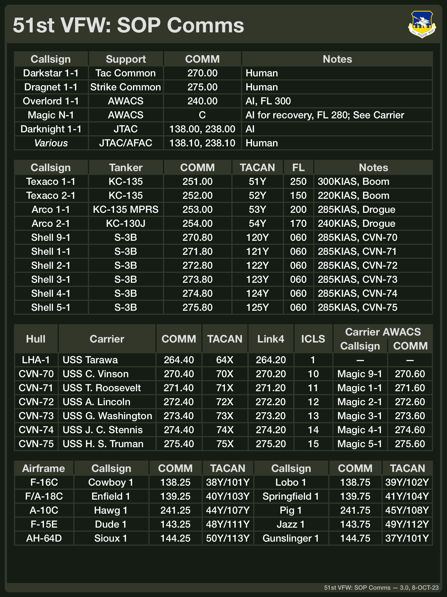

# General Mission Editing SOPs

This section covers a number of standard operating procedures (SOPs) mission designers should
employ around general mission elements such as communications, navigation, and operational
support. These SOPs are built around the airframes the 51st VFW currently supports: A-10C,
AH-64D, AJS37, AV-8B, F-14B, F-15E (soon), F-16C, F/A-18C, and other helicopter airframes.

Missions should follow the SOPs where possible and practical to provide consistency across
51st VFW missions. That being said, mission designers may deviate from these guidelines
where necessary due to the specific mission scenario.

## TACAN Usage Guidelines

TACAN channels in the mission should be assigned according to the following diagram.

Channels marked "unavailable" or "degraded" should be avoided. Default assignments for
TACAN channels are detailed below in the discussion of the communications plan and are
consistent with these assignments. The following figure shows which TACAN channels the SOPs
use.

Further details follow below.

## Tanker Altitude and Airspeed Guidelines
This thread from the [ED DCS Forums](https://forums.eagle.ru/topic/260542-looking-for-actualrecommened-aerial-refueling-speeds/)
discusses tanker altitude and airspeed guidelines for AAR units based on the the KC-135
airframe. The following table summarizes the guidelines relevant to the airframes the 51st
VFW operates.

|Airframe|Speed (KIAS)|Altitude|Notes|
|---|:---:|:---:|---|
|AV-8B|275|FL150-FL200|
|A-10C|220|FL150|
|F-14B|275-285|FL300|Source has no data, assumed to match F/A-18C
|F-16C|315|FL300|
|F/A-18C|275-285|FL300|

The 51st VFW SOPs track these guidelines with some adjustments as our missions may use
airframes other than the KC-135 for AAR tasking or perfer different altitudes.

The following table lists the full set of tankers that might be found in a mission along with
the default altitude and airspeeds the 51st VFW SOPs assume. A specific mission need not
provide all of these tankers and may deviate from these speeds (though missions should attempt
to provide speeds with 10-20kt of these speeds). As the DCS Mission Editor specifies route
speeds using ground speed, not KIAS, the following table lists the ground speeds necessary in
the DCS Mission Editor to achieve the default KIAS at the default altitude in calm conditions.

|Tanker|Airframes|Altitude|Speed (KIAS)|Speed (GS, ME)|Purpose|
|---|:---:|:---:|:---:|:---:|---|
|KC-135|F-16C|FL250|300|475|Boom, High Speed
|KC-135|A-10C|FL150|220|276|Boom, Low Speed
|KC-135 MPRS|AV8-B, F-14B, F/A-18C|FL200|285|384|Probe & Drogue
|KC-135 MPRS|AV8-B, F-14B, F/A-18C|FL210|285|388|Probe & Drogue
|S-3B Tanker|AV8-B, F-14B, F/A-18C|6000 MSL|285|309|Carrier

Keep in mind that ground speed may change based on altitude or other factors and may need to be
adjusted accordingly in the mission editor based on the specific scenario.

## Default Communications Plan

For consistency, missions should follow the default comms plan wherever possible. While these
defaults can support a wide range of missions, missions may deviate based on their specific
needs. Generally, the communications plan uses uniform for cross-wing communication and victor
for communication within a flight.

The following sections focus on specific pieces of the overall comms plan.

### ATC Frequencies

ATC frequencies (tower, ground, CTAF, ATIS, etc.) are set according to the published charts
for the airports in theater. Where published charts are unavailable, a mission may fill in
any missing frequencies as it sees fit.

A mission may elect to use modules such as [DATIS](https://github.com/rkusa/DATIS) to support
ATC communications.

### Support Elements

Support elements include the tactical common frequency as well as AWACS and JTAC/AFAC units
that may be present in a mission. The following table summarizes the standard communications
plan for these elements.

|Element|Frequency|Notes|   |Element|Frequency|Notes|
|---|:---:|:---|---|---|:---:|---|
|Tactical Common|270.00|Player AWACS/GCI
|Overlord 1-1 *AWACS*|240.00|FL300 AI| |Magic *N*-1 *Carrier AWACS*|See Below|FL280 AI
|Darknight 1-1 *JTAC*|138.00|AI| |Various *JTAC/AFAC*|138.10|Player

The frequencies are selected to support both human and AI in AWACS and JTAC/AFAC roles. For
AWACS/GCI, a mission that uses a human in the role would place the AWACS/GCI on the tactical
common frequency. Placing any AI AWACS/GCI on different frequencies prevents the AI from flooding
the radio. A mission that relies on only AI AWACS/GCI would place the tactical common frequncy
on one of the AWACS/GCI frequencies.

To allow multiple carriers in a mission, each carrier may have its own AWACS (an S-3B with the
callsign "Magic"). The following table summarizes the SOP carrier AWACS units.

|Element|Frequency|Notes|   |Element|Frequency|Notes|
|---|:---:|:---|---|---|:---:|---|
|Magic 9-1 *CVN-70 AWACS*|270.60|FL280 AI| |Magic 1-1 *CVN-71 AWACS*|271.60|FL280 AI
|Magic 2-1 *CVN-72 AWACS*|272.60|FL280 AI| |Magic 3-1 *CVN-73 AWACS*|273.60|FL280 AI
|Magic 4-1 *CVN-74 AWACS*|274.60|FL280 AI| |Magic 5-1 *CVN-75 AWACS*|275.60|FL280 AI

Frequencies for the carrier AWACS units generally follow the hull number of their associated
carrier and line up with the other carrier-related frequencies like the carrier AWACS or Link4
system.

### AAR Tankers

Given the tanker airspeed and altitude guidelines listed above, the SOPs include a basic set
of AAR tanker resources that should be sufficient for many missions. The SOPs use standard
flight names to differentiate the different taker airframes,

- *Texaco* flights support Air Force units (KC-135, boom, land-based), these flights may be
  low speed (for use by A-10C units) or high speed (for use by F-16C units)
- *Arco* flights support Navy units (KC-135 MPRS, probe & drogue, land-based)
- *Shell* flights support carrier recovery for Navy units (S-3B, probe & drogue,
  carrier-based)

Missions may support additional airframes (for example, KC-130), should follow the flight
naming conventions in the SOP. The following table summarizes the standard communications plan
for the non-carrier tankers supporting AAR.

|Tanker|TACAN|Frequency|Notes|   |Tanker|TACAN|Frequency|Notes|
|---|:---:|:---:|:---|---|---|:---:|:---:|---|
|Texaco 1-1 *Boom*|51Y|251.00|FL250 300KIAS|    |Texaco 2-1 *Boom*|52Y|252.00|15000 MSL 220KIAS
|Arco 1-1 *Probe & Drogue*|53Y|253.00|FL200 285KIAS|    |Arco 2-1 *Probe & Drogue*|54Y|254.00|FL210 285KIAS|

To eliminate some complexity, tanker TACAN channel and frequencies should be related as shown
in the table above (that is, frequency is always 200 + TACAN channel).

To allow for multiple carriers in a mission, each carrier may have its own recovery tanker (an
S-3B with the callsign "Shell") made available. All recovery tankers orbit at 6000MSL at 285KIAS.
The following table summarizes the SOP carrier recovery tankers.

|Tanker|TACAN|Frequency|   |Tanker|TACAN|Frequency|
|---|:---:|:---:|---|---|:---:|:---:|
|Shell 9-1 *CVN-70 Recovery*|120Y|270.80| |Shell 1-1 *CVN-71 Recovery*|121Y|271.80|
|Shell 2-1 *CVN-72 Recovery*|122Y|272.80| |Shell 3-1 *CVN-71 Recovery*|123Y|273.80|
|Shell 4-1 *CVN-74 Recovery*|124Y|274.80| |Shell 5-1 *CVN-75 Recovery*|125Y|275.80|

Frequencies and TACAN channels for the recovey tankers generally follow the hull number of
their associated carrier and line up with the other carrier-related frequencies like the
carrier AWACS or Link4 system.

As missions may require additional tankers, the SOPs set aside TACAN channels 55Y through 63Y
(along with their associated frequencies 255.0, 256.0, etc.) for use by additional tankers.

### Flights & Airframes

The SOPs include a base set of airframes that includes at least one flight from all of the
currently active airframes. Based on its needs, missions may change the airframes for a
particular flight while keeping the inter-flight frequency and TACAN channels. The following
table summarizes the standard communications plan for the wing for the base set of airframes.

|Flight / Arirframe|TACAN|Frequency|   |Flight / Arirframe|TACAN|Frequency|
|---|:---:|:---:|---|---|:---:|:---:|
|Cowboy 1 *F-16C*|38Y 101Y|138.25|    |Lobo 1 *F-16C*|39Y 102Y|138.75|
|Enfield 1 *F/A-18C*|40Y 103Y|139.25|    |Springfield 1 *F/A-18C*|41Y 104Y|139.75|
|Dodge 1 *F-14B*|42Y 105Y|140.25|    |Dodge 2 *F-14B*|43Y 106Y|140.75|
|Hawg 1 *A-10C*|44Y 107Y|141.25|    |Pig 1 *A-10C*|45Y 108Y|141.75|
|Pontiac 1 *AV-8B*|46Y 109Y|142.25|    |Pontiac 2 *AV-8B*|47Y 110Y|142.75|
|Dude 1 *F-15E*|48Y 111Y|143.25|    |Jazz 1 *F-15E*|49Y 112Y|143.75|
|Sioux 1 *AH-64D*|50Y 113Y|144.25|    |Gunslinger 1 *AH-64D*|37Y 100Y|144.75|
|Fjörd 1 *AJS37*|N/A|145.25|    |Björk 1 *AJS37*|N/A|145.75|

The TACAN pairs in this table describe the A2A yardstick setup: the lead uses the lower
numbered channel of the pair while the wingmen use the higher numbered channel of the pair.

Specific missions may choose different flight names as required. When deviating from the SOP
though, please avoid changes that may create confusion. For example, an F-16C flight could use
a name such as "Venom" or "Viper" that is not listed here; however, it should not use a name
such as "Enfield" or "Hawg" that is typically associated with a different airframe in the SOPs.

### Naval Units

Missions may include naval units for the launch and recovery of aircraft in the mission. The
following table lists the default comms plan for naval units.

|Hull|Ship|TACAN|Frequency|ICLS|Link4|
|---|---|:---:|:---:|---|---|
|LHA-1| USS *Tarawa*|64X|264.40|Ch. 1|264.20
|CVN-70| USS *Carl Vinson*|70X|270.40|Ch. 10|270.20
|CVN-71| USS *Theodore Roosevelt*|71X|271.40|Ch. 11|271.20
|CVN-72| USS *Abraham Lincoln*|72X|272.40|Ch. 12|272.20
|CVN-73| USS *George Washington*|73X|273.40|Ch. 13|273.20
|CVN-74| USS *John C. Stennis*|74X|274.40|Ch. 14|274.20
|CVN-75| USS *Harry S. Truman*|75X|275.40|Ch. 15|275.20

A mission may deploy multiple carriers. When doing so, it is suggested that the mission designer
avoid using CVN-70 (*Carl Vinson*) and CVN-74 (*John C. Stennis*) as the DCS Supercarrier
module does not support these ships.

### Default Kneeboards

Missions makers or planners are encouraged to make a summary of the relevant information from
the comms plan available on a kneeboard. Alternatively, they can use the default comms card
below.

This image is suitable for use as a DCS kneeboard. Based on the mission configuration, not all
of the information may be relevant to a particular mission.

# Airframe Specific SOPs

This section covers various airframe-specific SOPs and mission design guidelines that may be
helpful to keep in mind when designing missions that include the various airframes.

Missions should follow the SOPs where possible and practical to provide consistency across
51st VFW missions. That being said, mission designers may deviate from these guidelines
where necessary due to the specific mission scenario.

## A-10C

The A-10C Warthog is a single-seat, twin-turbofan, straight-wing, subsonic attack aircraft
designed for close air support (CAS) and forward air controller (FAC) missions.

### Mission Design Guidelines for the A-10C

TODO: A-10 design guidelines

### Comms Presets

TODO: No presets in ME?

## AH-64D

The AH-64D Apache is a twin-turboshaft attack helicopter with a tailwheel-type landing gear arrangement and a tandem cockpit for a crew of two.

### Mission Design Guidelines for the AH-64D

TODO: AH-64D design guidelines

### Comms Presets

TODO

## AJS37

The AJS37 Viggen is a single-seat, single-engine, short-medium range combat aircraft.

### Mission Design Guidelines for the AJS37

TODO: AJS37 design guidelines

### Comms Presets

Typically, comms presets are set up in the DCS ME according to the following table,

|Radio|Frequency|
|---:|:---|
|**Special 1**| Fjörd 1 Intraflight |
|**Special 2**| Björk 1 Intraflight |
|**Special 3**| Viggen Common or required mission frequency | 
|**H (Larm/Guard)**| Tactical Common |

Missions may deviate as necessary.

### Navigation Points

The Viggen uses navigation markers in addition to the steerpoints assigned to each unit through
the DCS ME. There are several different types as shown in the following table,

|Symbol|Type|Numbering|Notes
|---|:---:|:---:|---|
|B|Waypoint|1-9|General waypoints, these navigation points share numbering with the M points.
|M|Target|1-9|Target points, these navigation points share numbers with the B points.
|Bx|General|1-9|General points of interest (points 1-5) and anti-ship missile programming (points 6-9).
|R|Recon|1-9|Boundary of recon area for ELINT, minimum of four points is recommended.
|MR|Recon Target|1-9|Target locations within the recon area the R points define.

Markers are numbered sequentially as shown. With the exception of B and M types, all other
types are numbered independently (for example, a flight plan could have both B1 and Bx1 but not
B1 and M1).

To add a navigation marker, use the navigation point panel (marked with a square symbol) in the
DCS ME group editor for a Viggen group as shown below.

You can add, edit, and delete navigation points with the corresponding controls. The navigation
points show up in the ME map as small squares labeled with the assigned name.

## AV-8B

The AV-8B Harrier II is a single-seat, single-engine ground-attack aircraft, capable of
vertical or short takeoff and landing (V/STOL). The aircraft is primarily employed on light
attack or multi-role missions, ranging from close air support to armed reconnaissance.

### Mission Design Guidelines for the AV-8B

TODO: AV-8B design guidelines

### Comms Presets

TODO: V/UHF #1 x26, V/UHF #2 x26, V/UHF RCS x30

## F-14B

The F-14B Tomcat is a two-seat, twin-engine, carrier-capable, variable-sweep wing fighter
aircraft.

### Mission Design Guidelines for the F-14B

TODO: F-14B design guidelines

### INS Alignment

To reduce the time necessary to align the INS in a cold start, the Tomcat should be set up to
have an INS reference alignment stored in the jet. This can be done from the DCS ME group
editor for a Tomcat unit as the following figure illustrates.

Checking the "INS Reference Alignment Stored" option here will ensure the jet has a reference
alignment during cold starts.

TODO: UHF (-159) x20, V/UHF (-182) x30

## F-16C

The F-16C Viper is a single-seat, single-engine multirole fighter aircraft. Designed as an air
superiority day fighter, it has evolved into a successful all-weather multirole aircraft.

### Mission Design Guidelines for the F-14B

TODO: F-16C design guidelines

### Comms Presets

TODO: UHF (-164) x20, VHF (-222) x20

|UHF Preset|Purpose|   |VHF Preset|Purpose|
|:---:|:---|---|:---:|:---|
|1|Tactical Common||1|Inter-flight

## F/A-18C

The F/A-18C Hornet is a single-seat, twin-engine, all-weather, carrier-capable, multirole
combat jet, designed as both a fighter and attack aircraft.

### Mission Design Guidelines for the F-14B

TODO: F/A-18C design guidelines

### Comms Presets

TODO: COMM1 (-210) x20, COMM2 (-210) x20

# Miscellaneous SOPs

TODO

## Loadout references

- [Desert Storm Era](https://www.dstorm.eu/pages/loadout/loadout.html)

## Create a pull request!

    - Don't commit to master unless you are the main owner/delegated.

# TODO

- [] Add mids and tacan overlap documentation (don't mix the freqs!)
- [] Standard comms ladder per aircraft?

