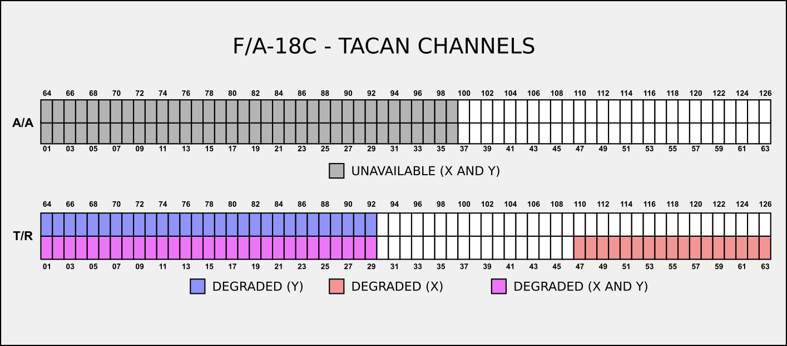

# Mission Editing Standard Operating Procedures

This section covers a number of SOPs mission designers should employ around mission elements
such as communications, navigation, and operational support. These SOPs are built around the
airframes the 51st VFW currently supports: A-10C, AV-8B, F-14B, F-16C, and F/A-18C.

Missions should follow the SOPs where possible and practical to provide consistency across
51st VFW missions. That being said, mission designers may deviate from these guidelines
where necessary due to the specific mission scenario.

## Tanker Altitude and Airspeed Guidelines
This thread from the [ED DCS Forums](https://forums.eagle.ru/topic/260542-looking-for-actualrecommened-aerial-refueling-speeds/)
discusses tanker altitude and airspeed guidelines for AAR units based on the the KC-135
airframe. The following table summarizes the guidelines relevant to the airframes the 51st
VFW operates.

|Airframe|Speed (KIAS)|Altitude|Notes|
|---|:---:|:---:|---|
|AV-8B|275|FL150-FL200|
|A-10C|220|FL150|
|F-14B|275-285|FL300|Source has no data, assumed to match F/A-18C
|F-16C|315|FL300|
|F/A-18C|275-285|FL300|

The 51st VFW SOPs track these guidelines with some adjustments as our missions may use
airframes other than the KC-135 for AAR tasking or perfer different altitudes.

The following table lists the full set of tankers that might be found in a mission along with
the default altitude and airspeeds the 51st VFW SOPs assume. A specific mission need not
provide all of these tankers and may deviate from these speeds (though missions should attempt
to provide speeds with 10-20kt of these speeds). As the DCS Mission Editor specifies route
speeds using ground speed, not KIAS, the following table lists the ground speeds necessary in
the DCS Mission Editor to achieve the default KIAS at the default altitude in calm conditions.

|Tanker|Airframes|Altitude|Speed (KIAS)|Speed (GS, ME)|Purpose|
|---|:---:|:---:|:---:|:---:|---|
|KC-135|F-16C|FL250|300|475|Boom, High Speed
|KC-135|A-10C|FL150|220|276|Boom, Low Speed
|KC-135 MPRS|AV8-B, F-14B, F/A-18C|FL200|285|384|Probe & Drogue
|KC-135 MPRS|AV8-B, F-14B, F/A-18C|FL210|285|388|Probe & Drogue
|S-3B Tanker|AV8-B, F-14B, F/A-18C|6000 MSL|285|309|Carrier

Keep in mind that ground speed may change based on altitude or other factors and may need to be
adjusted accordingly in the mission editor based on the specific scenario.

## TACAN Usage Guidelines

TACAN channels in the mission should be assigned according to the following diagram.

Channels marked "unavailable" or "degraded" should be avoided. Default assignments for
TACAN channels are detailed below in the discussion of the communications plan and are
consistent with these assignments.

## Default Communications Plan

For consistency, missions should follow the default comms plan to the extent possible. These
defaults are intended to support a wide range of missions, but specific msisions may not need
to support all units in the plan or may have additional communications needs not comprehended
here. The comms plan is broken up into two parts: air/ground units and naval units. Note
that ATC frequencies (tower, ground, ATIS, etc.) are set according to the published charts
for the airports in theater (where available, specific missions may fill in any missing
frequencies as needed) and are not shown here as they depend on the specific mission scenario.

The following table lists the default comms plan for air/ground units and support functions.

|Usage|TACAN|Frequency|Notes|   |Usage|TACAN|Frequency|Notes|
|---|:---:|:---:|:---|---|---|:---:|:---:|---|
|**Support**|
|Tactical Common|N/A|270.00|
|Overlord 1-1 *AWACS*|N/A|240.00|FL300| |Magic 1-1 *Carrier AWACS*|N/A|241.00|FL280
|Darknight 1-1 *JTAC*|N/A|138.00|AI| |Various *JTAC/AFAC*|N/A|138.10|Player
|**Tankers**|
|Texaco 1-1 *Boom*|51Y|251.00|FL250 300KIAS|    |Texaco 2-1 *Boom*|52Y|252.00|15000 MSL 220KIAS
|Arco 1-1 *Probe & Drogue*|53Y|253.00|FL200 285KIAS|    |Arco 2-1 *Probe & Drogue*|54Y|254.00|FL210 285KIAS|
|Shell 1-1 *Carrier Recovery*|55Y|255.00|6000 MSL 285KIAS|
|**Flights**|
|Colt 1 *F-16C*|38Y 101Y|138.25||    |Uzi 1 *F-16C*|39Y 102Y|138.75||
|Enfield 1 *F/A-18C*|40Y 103Y|139.25||    |Springfield 1 *F/A-18C*|41Y 104Y|139.75||
|Dodge 1 *F-14B*|42Y 105Y|140.25||    |Dodge 2 *F-14B*|43Y 106Y|140.75||
|Hawg 1 *A-10C*|44Y 107Y|141.25||    |Pig 1 *A-10C*|45Y 108Y|141.75||
|Pontiac 1 *Helicopter, AV-8B*|46Y 109Y|142.25||    |Chevy 1 *Helicopter, AV-8B*|47Y 110Y|142.75||
|Ford 1 *F-15E*|48Y 110Y|143.25||    |Ford 2 *F-15E*|49Y 111Y|143.75||

AWACS and Tactical Common may share the same frequency, depending on the sceario. In this case,
one of the two frequencies listed above should be chosen. The TACAN pairs in the flights
indicate the A2A yardstick setup: the lead uses the lower numbered channel of the pair while
the wingmen use the higher numbered channel of the pair.

The following table lists the default comms plan for naval units.

|Hull|Ship|TACAN|Frequency|ICLS|
|---|---|:---:|:---:|---|
|LHA-1| USS *Tarawa*|64X|264.40|Ch. 1|
|CVN-70| USS *Carl Vinson*|70X|270.40|Ch. 10|
|CVN-71| USS *Theodore Roosevelt*|71X|271.40|Ch. 11|
|CVN-72| USS *Abraham Lincoln*|72X|272.40|Ch. 12|
|CVN-73| USS *George Washington*|73X|273.40|Ch. 13|
|CVN-74| USS *John C. Stennis*|74X|274.40|Ch. 14|
|CVN-75| USS *Harry S. Truman*|75X|275.40|Ch. 15|

Missions are encouraged to make a summary of the of the comms plan that they implemenmt
available on a kneeboard.

**TODO**: kneeboard for default comms plan?

## Default Comms Ladder

Missions should configure the presets on radios in client aircraft with the default comms ladder
this section describes.

### A-10C
TODO: No presets in ME?

### AV-8B
TODO: V/UHF #1 x26, V/UHF #2 x26, V/UHF RCS x30

### F-14B
TODO: UHF (-159) x20, V/UHF (-182) x30

### F-16C
TODO: UHF (-164) x20, VHF (-222) x20

|UHF Preset|Purpose|   |VHF Preset|Purpose|
|:---:|:---|---|:---:|:---|
|1|Tactical Common||1|Inter-flight

### F/A-18C
TODO: COMM1 (-210) x20, COMM2 (-210) x20

## Miscellaneous
### Loadout references
- [Desert Storm Era](https://www.dstorm.eu/pages/loadout/loadout.html)
### Create a pull request!
    - Don't commit to master unless you are the main owner/delegated.

## TODO
- [] Add mids and tacan overlap documentation (don't mix the freqs!)
- [] Standard comms ladder per aircraft?

